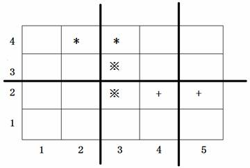

**Arrange Seats**

**Problem description**

In class, there are always some students whispering to the surrounding students, this is a headache for the primary school head teacher. However, Xiaoxue, the head teacher, found some interesting phenomena. When the seats of the students were determined, only a limited number of D students would whisper to each other in class.

The students sit in M rows and N columns in the classroom. The position of the students sitting in row i and column j is (i, j). In order to facilitate students to enter and exit, K horizontal channels and L vertical channels are set in the classroom.

So the clever Xiaoxue thought of a way to reduce the problem of students whispering in class: she planned to rearrange the desks and chairs, changing the position of the passage between the desks and chairs, because if a passage separated two students who would whisper in class, then they would not whisper to each other.

Please help to write a program for Xiaoxue to give the best channel division scheme. Under the scheme, the number of students who talk to each other in class is minimal.

**Input**

In the first line, there are 5 integers separated by spaces, namely M, N, K, L, D (2 ≤ N, M ≤ 1000, 0 ≤ K \< M, 0 ≤ L \< N, D ≤ 2000).

For the next D lines, there are 4 integers separated by spaces in each line. The 4 integers in the i^th^ line X~i~, Y~i~, P~i~, Q~i~, represents that the two students sitting at (X~i~, Y~i~) and (P~i~, Q~i~) will whisper to each other (The input data ensures that they are next to each other, back and forth or left and right).

The input data ensure the uniqueness of the optimal scheme.

**Output**

The output file consists of two lines.

The first line contains K integers, a~1~, a~2~, \..., a~K~, indicates channels are opened between lines a~1~ and a~1~+1, between lines a~2~ and a~2~+1,\... between lines a~K~ and a~K~+1, where a~i~ \< a~i+1~, and every two integers are separated by spaces (there is no space at the end of the line).

The second line contains L integers, b~1~, b~2~\..., b~L~, indicates channels are opened between column b~1~ and column b~1~ +1, between column b~2~ and column b~2~+1, \..., between column b~L~ and column b~L~+1, where b~i~\< b~i+1~ and every two integers are separated by spaces (there is no space at the end of the row).

**Sample Input**

4 5 1 2 3

4 2 4 3

2 3 3 3

2 5 2 4

**Sample Output**

2

2 4

**Hint**

In the figure above, the positions of three pairs of students who will whisper to each other are marked with symbols \*, ※ and +. The positions of the three thick lines in the figure represent the channels. The channel division scheme shown in the figure is the only best scheme.
