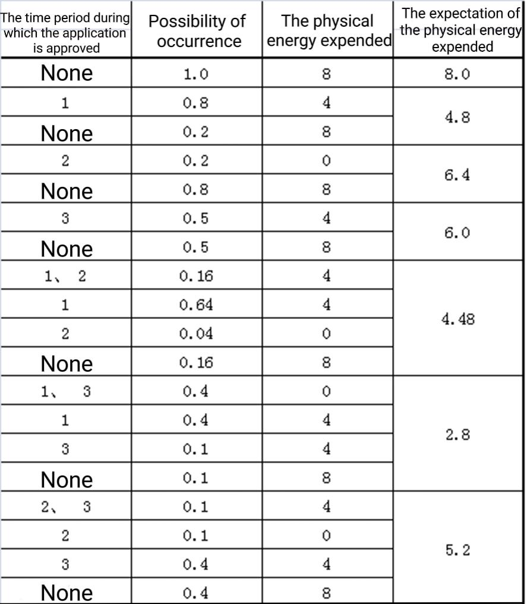
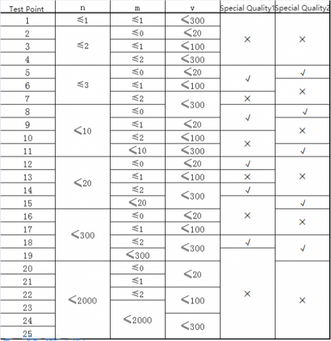

**Change Classrooms**

**Problem Description**

For Niuniu, who just started college, the first problem he faced was how to apply for the right program based on the actual situation.

Among the available courses, there are 2n classes scheduled over n time periods. In the i^th^ (1 ≤ i ≤ n) time slot, two courses with the same content are held in different locations at the same time, where Niuniu is prearranged to be taught in classroom c~i~, while the other course is held in classroom d~i~.

Without submitting any application, students are required to complete all n scheduled classes in the sequence of time slots. Students need to make an application if they want to change their classroom for the i session. If the application is approved, the student can attend class in room d~i~ during the i^th^ period, otherwise, the class will remain in room c~i~.

Due to the high demand for changing classrooms, the application may not be approved. Through calculation, Niuniu found that the probability of the application being approved when changing the classroom of class i was a known real number k~i~, and the probability of the application being approved for different courses was independent of each other.

The university stipulates that all applications can only be submitted at once before the semester begins, and each person can only choose up to m classes to apply for. This means that Niuniu must decide once and for all whether to apply for a change of classroom for each class, rather than deciding whether to apply for other classes based on the results of applications for some classes; Niuniu can apply for the m courses he most wants to change classrooms, but he doesn't have to use all m applications, or he can apply for no course at all.

Because different courses may be arranged in different classrooms, Niuniu needs to use the time between classes to travel from one classroom to another.

Niuniu's university has v classrooms and e roads. Each road connects two classrooms and is passable in both directions. Due to the length of the road and the level of congestion, the physical energy required to traverse the different roads may vary. When class i (1 ≤ i ≤ n-1) is over, Niuniu will start from the classroom of this class and choose a path that consumes the least amount of physical energy to go to the classroom of the next class.

Now Niuniu wants to know which courses he can apply to minimize the expected value of the sum of the physical energy he needs to move between classrooms. Please help him find this minimum value.

**Input**

There are four integers n, m, v, and e in the first line. n denotes the number of time slots within the semester; m denotes the maximum number of classes that Niuniu can apply to change. v denotes the number of classrooms in Niuniu's university; e denotes the number of roads in Niuniu's university.

There are n positive integers in the second line, and the i^th^ (1 ≤ i ≤ n) positive integer represents c~i~, which is the classroom where Niuniu is scheduled to attend classes during the i^th^ time period; ensure that 1 ≤ c~i~ ≤ v.

There are n positive integers in the third line, and the i^th^ (1 ≤ i ≤ n) positive integer denotes d~i~, which is the other classroom having the same course in the i^th^ time period; ensure that 1 ≤ d~i~ ≤ v.

There are n real numbers in the fourth line, and the i^th^ (1 ≤ i ≤ n) real number represents k~i~, which is the probability that Niuniu's application for changing classrooms in the i^th^ time period could be approved. Ensure that 0 ≤ k~i~ ≤ 1.

For the next e lines, there are three positive integers a~j~, b~j~, w~j~ in each line, which means that there is a two-way road connecting the classrooms a~j~ and b~j~, and the physical energy required to pass this road is w~j~; ensure that 1 ≤ a~j~, b~j~ ≤ v, 1 ≤ w~j~ ≤ 100.

Ensure that 1 ≤ n ≤ 2000, 0 ≤ m ≤ 2000, 1 ≤ v ≤ 300, and 0 ≤ e ≤ 90000.

Ensure that all the classrooms can be reached from any one of them by the roads in the school.

Ensure the real numbers in the input contain at most 3 decimal places.

**Output**

Output a line containing a real number, rounded to exactly 2 decimal places, indicating the answer. Your output must be exactly the same as the standard output to be correct.

The test data guarantees that the absolute difference between the rounded answer and the exact answer is no greater than 4 × 10^-3^. (If you don\'t know what a floating-point error is, this paragraph can be interpreted as meaning: For most algorithms, you can use floating-point as normal without doing anything special with it.)

**Sample Input**

3 2 3 3

2 1 2

1 2 1

0.8 0.2 0.5

1 2 5

1 3 3

2 3 1

**Sample Output**

2.80

**Hint**

**\[Explanation of the Sample\]**

All feasible application options and expected benefits are listed in the following table:

**\[Hint\]**

1\. There may be multiple two-way roads connecting the same two classrooms on the road. It is also possible that both ends of the road connect to the same classroom.

2\. Be careful to distinguish the meaning of n, m, v, and e. n is not the number of classrooms and m is not the number of roads.

Special quality 1: Between any two points a~i~ and b~i~, a~i~ ≠ b~i~ on the graph, there is a path that consumes the least amount of energy and contains only one road.

Special quality 2: For all 1≤ i ≤ n, k~i~ = 1.
