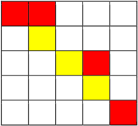
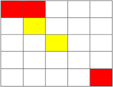

**Checkerboard**

**Problem Description**

There is an m×m checkerboard, and each grid on the board may be red, yellow, or no color at all. You will now go from the top left corner of the board to the bottom right corner of the board.

At any given moment, the position you are standing in must be colored (not colorless), and you can only go up, down, left, or right. When you go from one grid to another, if both grids are the same color, you don\'t have to spend any gold coins. If not, it costs you 1 gold coin.

In addition, you can spend 2 gold coins to cast a spell to temporarily change the next colorless grid to the color you specify. But the spell can't be used continuously, and the duration of the spell is very short, which means that if you use the spell and walk onto the temporarily colored grid, you can't continue to use the spell. You can only use the spell again if you leave the grid and walk onto a grid that is already colored, and when you leave the grid (the one you cast a spell to make colored), the grid becomes colorless.

Now you want to go from the top left corner of the board to the bottom right corner of the board, and figure out what's the minimum amount of gold coins that you spend.

**Input**

The first line contains two positive integers, m, and n, separated by a space, representing the size of the board and the number of colored grids on the board.

The next n lines, each with three positive integers x,y, and c, represent that the grid with coordinate (x,y) has the color c, where c=1 represents yellow and c=0 represents red. Two adjacent numbers are separated by a space. The coordinate of the grid in the top left corner of the board is (1,1), and the coordinate of the grid in the bottom right corner is (m,m). The rest of the grids are colorless. It is ensured that the top left corner of the board, which is (1,1), is colored.

**Output**

An integer that represents the minimum amount of gold coins spent. Print −1 if you can not reach the destination.

**Sample Input**

5 7

1 1 0

1 2 0

2 2 1

3 3 1

3 4 0

4 4 1

5 5 0

**Sample Output**

8

**Hint**

**Sample Input 2**

5 5
1 1 0
1 2 0
2 2 1
3 3 1
5 5 0

**Sample Output 2**

-1

**\[Explanation for Sample 1\]**

You start at (1,1), and it doesn't cost you gold to go to (1,2).

It costs 1 gold to go from (1,2) down to (2,2).

Cast a spell from (2,2) to turn (2,3) yellow for 2 gold coins.

It doesn't cost gold to go from (2,2) to (2,3).

It doesn't cost gold to go from (2,3) to (3,3).

It costs 1 gold to go from (3,3) to (3,4).

It costs 1 gold to go from (3,4) to (4,4).

Cast a spell from (4,4) to turn (4,5) yellow for 2 gold coins,

It doesn't cost gold to go from (4,4) to (4,5).

It costs 1 gold to go from (4,5) to (5,5).

It costs 8 gold coins.

**\[Explanation for Sample 2\]**

It doesn't cost gold to go from (1,1) to (1,2).

It costs 1 gold to go from (1,2) to (2,2).

Cast a spell to turn (2,3) yellow for 2 gold and go from (2,2) to (2,3).

It doesn't cost gold to go from (2,3) to (3,3).

From (3,3), you can only cast a spell to reach (3,2),(2,3),(3,4), or (4,3).

However, you can not reach (5,5) from the above four points, so you cannot reach the endpoint. Therefore, output -1.

**\[Data Size and Constraints\]**

For 30% of the data, 1 ≤ m ≤ 5, 1 ≤ n ≤ 10.

For 60% of the data, 1 ≤ m ≤ 20, 1 ≤ n ≤ 200.

For 100% of the data, 1 ≤ m ≤ 100, 1 ≤ n ≤1,000.
