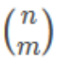
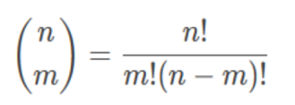
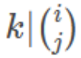
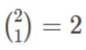
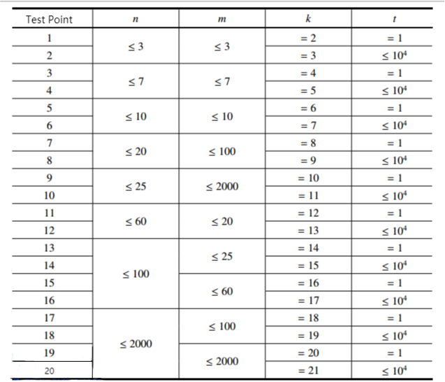

**Combinatorial Number Problem**

**Problem Description**

The combinatorial number  indicates the number of options to select m items out of n items. For example, choosing two items out of three items (1,2,3) can be done in three ways: (1,2),(1,3),(2,3). Based on the definition of combinatorial numbers, we can give a general formula for calculating the combinatorial number:

Where n!= 1 × 2 × \... × n; In particular, define 0!= 1.

Xiaocong wants to know if given n, m and k, for all 0 ≤ i ≤ n, 0 ≤ j ≤ min(i, m), how many pairs of (i, j) satisfy that 

**Input**

The first line has two integers t and k, where t represents how many sets of test data there are in total at that test point. The meaning of k is described in the problem description.

Next t lines each have two integers n and m, and the meanings of n and m are shown in the problem description.

Output

There are t lines, each line with an integer representing 0 ≤ i ≤ n, 0 ≤ j ≤ min(i,m). how many pairs of the (i, j) with 

**Sample Input 1**

1 2

3 3

**Sample Output 1**

1

**Sample Input 2**

2 5

4 5

6 7

**Sample Output 2**

0

7

**Hint**

**\[Explanation of Sample 1\]**

Of all the possible cases, only  is a multiple of 2.

**\[Subtask\]**

\- For all test points, make sure 0 ≤ n, m ≤ 2 × 10^3^, 1 ≤ t ≤ 10^4^.
