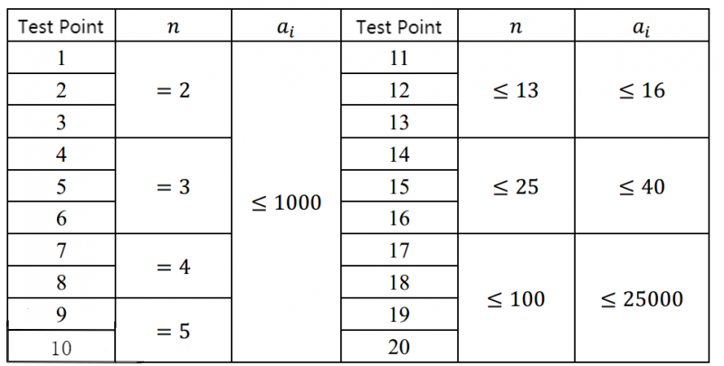

**Currency System**

**Problem Description**

There are n different denominations of currency in the country of Internet users. The i^th^ currency is denomination a\[i\]. You can assume that there are infinite pieces of each currency. For convenience, we will denote a currency system with n denominations and an array of denominations a\[1..n\] as (n,a).

In a perfect currency system, every non-negative integer amount x should be able to be represented, that is, for every non-negative integer x, there are n non-negative integers t\[i\] that satisfy a\[i\]×t\[i\] is equal to x. However, in the realm of Internet users, the currency system may be imperfect, that is, there may be an amount x that cannot be represented by the currency system. For example, in the currency system n=3, a=\[2,5,9\], the amount 1 and 3 cannot be represented.

Two currency systems (n,a) and (m,b) are equivalent if and only if, for any non-negative integer x, it either could be represented by both currency systems or could not be represented by either.

Now, these Internet users are going to simplify the currency system. They want to find a currency system (m, b) such that (m, b) is equivalent to the original currency system (n, a), and m is as small as possible. They want you to help with the difficult task of finding the smallest m.

**Input**

The first line of the input file contains an integer T for the number of groups of data.

Next, each of the T groups is given in the following format: The first line of each group contains a positive integer n. The second line contains n positive integers a\[i\] separated by spaces.

**Output**

The output file has T lines in total, and for each set of data, the output line contains a positive integer representing the smallest m of all currency systems (m,b) that are equivalent to (n,a).

**Sample Input**

2

4

3 19 10 6

5

11 29 13 19 17

**Sample Output**

2

5

**Hint**

In the first set of data, the currency system (2, \[3,10\]) is equivalent to the given money system (n, a), and it can be verified that there is no equivalent money system with m \< 2, so the answer is 2. In the second set of data, it can be verified that there is no equivalent money system with m \< n, so the answer is 5.

**\[Data Range and Conventions\]**

For 100% of the data, satisfy 1 ≤ T ≤ 20, n, a\[i\] ≥ 1.
