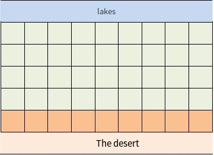
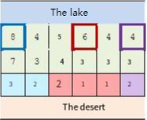
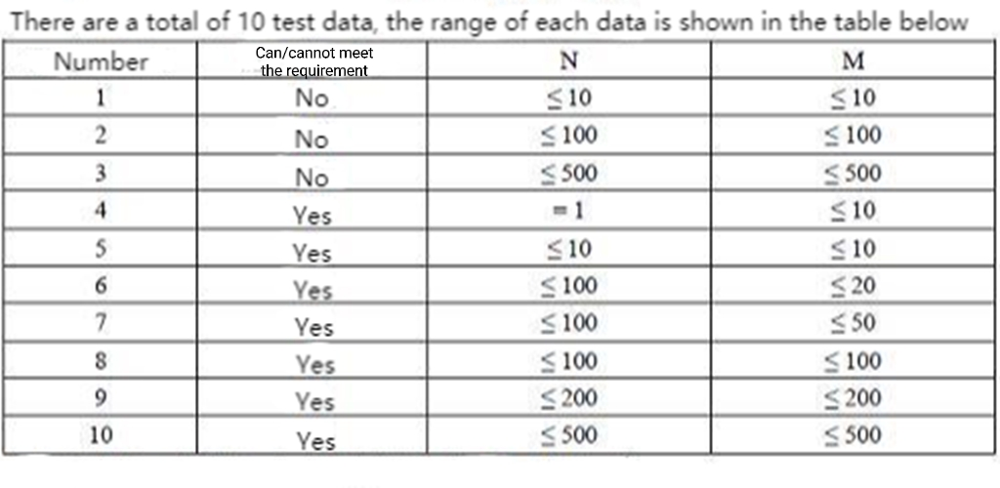

**Divert water into the city**

**Problem Description**

In a distant country, there is a beautiful lake on one side and an endless desert on the other. The administrative division of the country is so special that it forms a rectangle with N lines by M columns, as shown in the picture, where each grid represents a city, and each city has an altitude.

Water facilities are now being built in some cities to give the residents as much clear water as possible. There are two kinds of water facilities, which are water storage plants and water transmission stations. The function of the water storage plant is to use pumps to draw water from the lake to the reservoir in the city.

Therefore, only the cities in row 1, which are adjacent to the lake, can build water storage plants. The function of the water station, on the other hand, is to transport the lake water from high to low by using the height drop through the water pipeline. Therefore, the premise for a city to build water transmission stations is that there are neighboring cities with a higher altitude sharing a common edge with this city and that this neighboring city has built water facilities. Since the cities in the N~th~ row are close to the desert and are the arid areas of the country, each of them is required to have water conservancy facilities. Can this requirement be met? If so, please calculate the minimum number of water storage plants to be built; if not, find the number of cities in arid areas where building water facilities are not possible.

**Input**

Two numbers per line, separated by a space. The first line of input contains two positive integers N and M, representing the size of the rectangle. For the next N lines, each line contains M positive integers representing the elevation of each city.

**Output**

Two lines. If the requirements can be met, the first line of the output is an integer 1, and the second row is an integer representing the minimum number of water storage plants to be built; if the requirements can not be met, the first line is an integer 0, and the second row is an integer indicating the number of arid cities where water facilities are unlikely to be built.

**Sample Input 1**

2 5

9 1 5 4 3

8 7 6 1 2

**Sample Output 1**

1

1

**Sample Input 2**

3 6

8 4 5 6 4 4

7 3 4 3 3 3

3 2 2 1 1 2

**Sample Output 2**

1

3

**Instructions/Hint**

**\[Explanation of Sample 1\]**

We only need to build a water storage plant in the city at an altitude of 9 to meet the requirements.

**\[Explanation of Sample 2\]**

In the above image, building water storage plants in three cities framed by thick lines can meet the requirements. Water transmission stations built in arid areas from these three aquifers are shown in three colors. Of course, the construction method may not be unique.

**\[Data Range\]**

For all data points, the altitude of each city is no higher than 10^6^.
