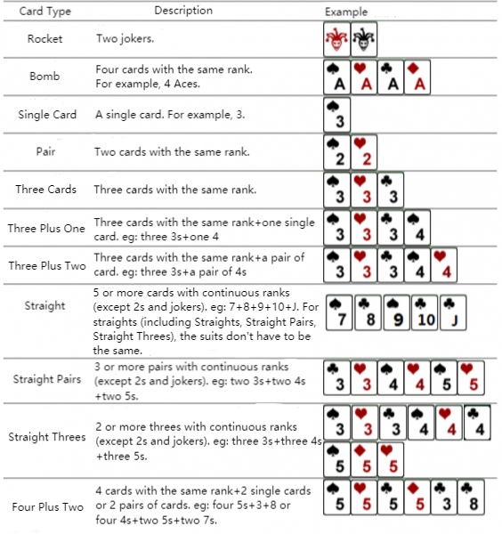

# 斗地主

## 题目描述

牛牛最近迷上了一种叫斗地主的扑克游戏。斗地主是一种使用黑桃、红心、梅花、方片的 $A$ 到 $K$ 加上大小王的共 $54$ 张牌来进行的扑克牌游戏。在斗地主中，牌的大小关系根据牌的数码表示如下：$3<4<5<6<7<8<9<10<J<Q<K<A<2<\text{小王}<\text{大王}$，而花色并不对牌的大小产生影响。每一局游戏中，一副手牌由 $n$ 张牌组成。游戏者每次可以根据规定的牌型进行出牌，首先打光自己的手牌一方取得游戏的胜利。

现在，牛牛只想知道，对于自己的若干组手牌，分别最少需要多少次出牌可以将它们打光。请你帮他解决这个问题。

需要注意的是，本题中游戏者每次可以出手的牌型与一般的斗地主相似而略有不同。具体规则如下：

 

## 输入格式

第一行包含用空格隔开的 $2$ 个正整数 $T,n$，表示手牌的组数以及每组手牌的张数。

接下来 $T$ 组数据，每组数据 $n$ 行，每行一个非负整数对 $a_i,b_i$，表示一张牌，其中 $a_i$ 表示牌的数码，$b_i$ 表示牌的花色，中间用空格隔开。特别的，我们用 $1$ 来表示数码 $A$，$11$ 表示数码 $J$，$12$ 表示数码 $Q$，$13$ 表示数码 $K$；黑桃、红心、梅花、方片分别用 $1-4$ 来表示；小王的表示方法为 `0 1`，大王的表示方法为 `0 2`。

## 输出格式

共 $T$ 行，每行一个整数，表示打光第 $i$ 组手牌的最少次数。

## 样例 #1

### 样例输入 #1

```
1 8
7 4
8 4
9 1
10 4
11 1
5 1
1 4
1 1
```

### 样例输出 #1

```
3
```

## 样例 #2

### 样例输入 #2

```
1 17
12 3
4 3
2 3
5 4
10 2
3 3
12 2
0 1
1 3
10 1
6 2
12 1
11 3
5 2
12 4
2 2
7 2
```

### 样例输出 #2

```
6
```

## 提示

**样例 1 说明**

共有 $1$ 组手牌，包含 $8$ 张牌：方片 $7$，方片 $8$，黑桃 $9$，方片 $10$，黑桃 $J$，黑桃 $5$，方片 $A$ 以及黑桃 $A$。可以通过打单顺子（方片 $7$，方片 $8$，黑桃 $9$，方片 $10$，黑桃 $J$），单张牌（黑桃 $5$）以及对子牌（黑桃 $A$以及方片 $A$）在 $3$ 次内打光。

对于不同的测试点， 我们约定手牌组数 $T$ 与张数 $n$ 的规模如下：

| 测试点编号 | $T=$ | $n=$ |
| :--------: | :-----: | :----: |
|     1     | $100$ | $2$ |
|     2     | $100$ | $2$ |
|     3     | $100$ | $3$ |
|     4     | $100$ | $3$ |
|     5     | $100$ | $4$ |
|     6     | $100$ | $4$ |
|     7     | $100$ | $10$ |
|     8     | $100$ | $11$ |
|     9     | $100$ | $12$ |
|     10     | $100$ | $13$ |
|     11     | $100$ | $14$ |
|     12     | $100$ | $15$ |
|     13     | $10$ | $16$ |
|     14     | $10$ | $17$ |
|     15     | $10$ | $18$ |
|     16     | $10$ | $19$ |
|     17     | $10$ | $20$ |
|     18     | $10$ | $21$ |
|     19     | $10$ | $22$ |
|     20     | $10$ | $23$ |

数据保证：所有的手牌都是随机生成的。
