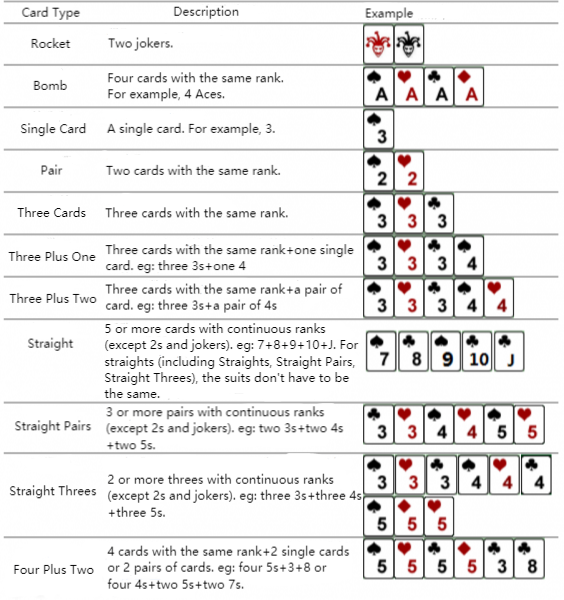

**Doudizhu**

**Problem Description**

Niuniu has recently become obsessed with a poker game called Doudizhu. Doudizhu is a card game played with a total of 54 cards, including Aces to Kings of spades, hearts, clubs, diamonds, and Jokers. In Doudizhu, the rank of the card is based on the number of cards as follows: 3\<4\<5\<6\<7\<8\<9\<10\<J\<Q\<K\<A\<2\<black joker\<red joker, and the suit does not have an impact on the rank of the card. In each game, a hand consists of n cards. Players can play cards according to the prescribed card type each time, and the first person to empty his/her hand wins the game.

Now, Niuniu just wants to know, for his several groups of hand cards, respectively, the minimum number of times he needs to draw his cards to empty his hands. Please help him solve this problem.

It should be noted that in this case, the player can play a similar but slightly different card type with the general rules of Doudizhu. The specific rules are as follows:

**Input**

The first line contains 2 positive integers T and n, separated by a space, indicating the number of groups of hands and the number of cards in each group.

Then, there are T groups of data. Each group contains n rows, and each row contains a non-negative integer pair a~i~, b~i~, representing a card, where a~i~ represents the rank of the card, and b~i~ represents the suit of the card, separated by a space. Specifically, we use 1 for rank A, 11 for rank J, 12 for rank Q, and 13 for rank K. Spades, hearts, clubs, and diamonds are represented by 1-4; The black joker is represented by 0 1, and the red joker is represented by 0 2.

**Output**

There are T lines, one integer per line, indicating the minimum number of times to empty the hands in the i~th~ group.

**Sample Input 1**

1 8

7 4

8 4

9 1

10 4

11 1

5 1

1 4

1 1

**Sample Output 1**

3

**Sample Input 2**

1 17

12 3

4 3

2 3

5 4

10 2

3 3

12 2

0 1

1 3

10 1

6 2

12 1

11 3

5 2

12 4

2 2

7 2

**Sample Output 2**

6

**Hint**

**\[Explanation of Sample 1\]**

There is a hand of 8 cards: 7 of diamonds, 8 of diamonds, 9 of spades, 10 of diamonds, Jack of spades, 5 of spades, Ace of diamonds, and Ace of spades. It can be played in 3 turns by playing straight (7 of diamonds, 8 of diamonds, 9 of spades, 10 of diamonds, Jack of spades), a single card (5 of spades), and pair (Ace of diamonds, and Ace of spades).

For different test points, the scale of the number of groups of hands T and the number of cards n as follows:

The data guarantees that: All hands are randomly generated.
