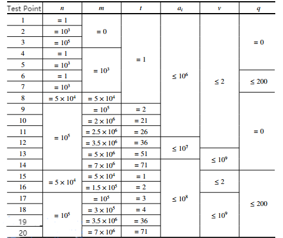

**Earthworms**

**Problem Description**

In this case, we'll use the symbol ⌊c⌋ to mean rounding down c. For example: ⌊ 3.0 ⌋ = ⌊ 3.1 ⌋ = ⌊ 3.9 ⌋ = 3.

Cricket country is suffering from earthworms recently! The fleas in the flea country next door also have nothing to do with the earthworms, so King Cricket has to ask the master of knives to help them destroy the earthworms.

Cricket country now has a total of n earthworms (n is a positive integer). Each earthworm has a length. Let's say the length of the i^th^ earthworm is a~i~ (i =1, 2, \..., n) and ensure that all the lengths are non-negative integers (i.e.: there may exist earthworms of length 0).

Every second, the master of knives will accurately find the longest earthworm among all the earthworms (choose any one of the longest if there are more than one) and cut it in half. The position where the master of knives cuts the earthworm is determined by a constant p (which is a rational number satisfying 0 \< p \< 1). Let this earthworm be of length x, and the master of knives will cut it into two earthworms of length ⌊px ⌋and x-⌊px ⌋. In particular, if one of the two numbers is equal to 0, the earthworm of length 0 will also be kept. In addition, except for the two new worms that have just been created, the length of the earthworms will increase by q (which is a non-negative integer constant).

King Cricket knows that this is not a long-term solution, because not only will there be more and more worms, but they will also get longer and longer. King Cricket decides to appeal to a mysterious figure with mystical powers, but the support would take another m seconds to arrive\...(m is a non-negative integer)

King Cricket wants to know what's going on in those m seconds. Specifically, he wants to know:

-The length of the cut earthworm before it was cut in each of the m seconds (there are m numbers);

-length of all earthworms after m seconds (with n + m numbers).

Of course, King Cricket knows how to do this! But he wants to test you\...

**Input**

The first line contains six integers n,m,q,u,v, and t, where: see \[Problem Description\] for the meaning of n,m,q; u,v,t are all positive integers. You need to calculate p=u/v yourself (make sure 0 \< u \< v); t is the output parameter, the meaning of which will be explained in \[Output\].

The second line contains n non-negative integers a~1~, a~2~, \..., a~n~, which is the length of the n earthworms at the beginning.

Two adjacent numbers are separated by one space.

Ensure that 1 ≤ n ≤ 10^5^, 0 ≤ m ≤ 7 × 10^6^, 0 \< u \< v ≤ 10^9^, 0 ≤ q ≤ 200, 1 ≤ t ≤ 71, and 0 ≤ a~i~ ≤ 10^8^.

**Output**

The first line outputs ⌊⌋integers, which are the length of the cut earthworm (before it is cut) at t^th^ second, 2t^th^ second, 3t^th^ second\... in chronological order.

The second line outputs ⌊⌋integers, which are the length of the earthworms after m seconds. Please output these in descending order, output the lengths ranked t, 2t, 3t\... in order.

Two adjacent numbers are separated by a space. You should print a blank line even if there are no numbers to print on a particular line.

Read the samples to better understand the format.

**Sample Input 1**

3 7 1 1 3 1

3 3 2

**Sample Output 1**

3 4 4 4 5 5 6

6 6 6 5 5 4 4 3 2 2

**Sample Input 2**

3 7 1 1 3 2

3 3 2

**Sample Output 2**

4 4 5

6 5 4 3 2

**Sample Input 3**

3 7 1 1 3 9

3 3 2

**Sample Output 3**

//blank line

2

**Hint**

**\[Explanation of Sample 1\]**

Before the master of knives comes, the length of three earthworms is 3, 3, 2.

1 second later: an earthworm of length 3 is cut into two earthworms of length 1 and 2, and the length of the remaining earthworms is increased by 1. The final four earthworms had lengths of (1,2),4,3. The parentheses indicate that an earthworm has just been cut off at this location

2 seconds later: an earthworm of length 4 has been cut into 1 and 3. The lengths of the five earthworms are: 2,3,(1,3),4.

3 seconds later: an earthworm of length 4 is cut. The lengths of the six earthworms are: 3,4,2,4,(1,3).

4 seconds later: an earthworm of length 4 is cut. The lengths of the seven earthworms are: 4,(1,3),3,5,2,4.

5 seconds later: an earthworm of length 5 is cut. The lengths of the eight earthworms are: 5,2,4,4,(1,4),3,5.

6 seconds later: an earthworm of length 5 is cut. The lengths of the nine earthworms are: (1,4),3,5,5,2,5,4,6.

7 seconds later: an earthworm of length 6 is cut. The lengths of the 10 earthworms are: 2,5,4,6,6,3,6,5,(2,4). So, the lengths of earthworms cut in 7 seconds are 3,4,4,4,5,5,6, in that order. After 7 seconds, all earthworms are sorted from largest to smallest in length: 6,6,6,5,5,4,4,3,2,2.

**\[Explanation of Sample 2\]**

Only t=2 in this data is different from the previous data. Simply print one number for every two numbers on each line instead.

Even though there is a 6 at the end of the first line that is not printed, the second line still has to start over from the second number.

**\[Explanation of Sample 3\]**

Only t=9 in this data is different from the previous data.

Note that there is no number to output on the first line, but you still need to output a blank line.

**\[Data Range\]**

