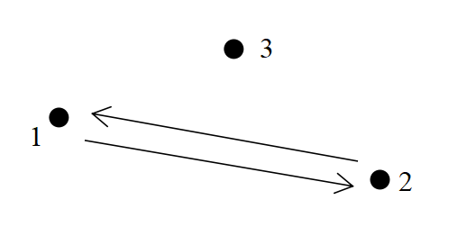
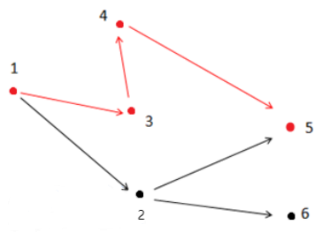

**Find the Way**

**Problem Description**

In a directed graph G, each edge has a length of 1. Now, given a starting point and an ending point, find a path from the starting point to the ending point in the graph that satisfies the following conditions:

1\. The outgoing edges of all points on the path point to points that are directly or indirectly connected to the endpoint.

2\. Make the path shortest while Condition 1 is satisfied.

Note: There may be multiple edges and self-loops in graph G, and the problem guarantees that there is no outgoing edge at the end.

Please output the length of the qualified path.

**Input**

The first line has two integers n and m separated by a space, indicating that the graph has n points and m edges.

The next m lines each have 2 integers x, and y, separated by a space, indicating that there is an edge from point x to point y.

The last line has two integers s, t, separated by a space, indicating that the starting point is s and the ending point is t.

**Output**

The output is one line and contains an integer indicating the length of the shortest path that satisfies the description of the question. If such a path does not exist, output -1.

**Sample Input 1**

3 2

1 2

2 1

1 3

**Sample Output 1**

-1

**Sample Input 2**

6 6

1 2

1 3

2 6

2 5

4 5

3 4

1 5

**Sample Output 2**

3

**Hint**

**Explanation 1:**

As shown in the image above, arrows indicate directed roads and dots indicate cities. Starting point 1 is not connected to ending point 3, so a path satisfying the description does not exist, so -1 is the output.

**Explanation 2:**

As shown in the figure above, the path that satisfies the condition is 1 → 3 → 4 → 5. Note that point 2 cannot be in the answer path because point 2 is connected to point 6, which is not connected to endpoint 5.

**\[Data Range\]**

For 30% of the data, 0 \< n ≤ 10, 0 \< m ≤ 20;

For 60% of the data, 0 \< n ≤ 100, 0 \< m ≤ 2000;

For 100% of the data,0 \< n ≤ 10000, 0 \< m ≤ 200000, 0 \< x,y,s,t ≤n, x,s ≠ t.
