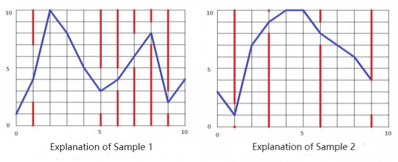

**Flappy Bird**

**Problem Description**

'Flappy Bird' is a popular casual mobile game. Players need to constantly control the frequency of tapping the phone screen to adjust the bird's flight height so that the bird can smoothly pass through the pipe gap on the right side of the screen. If the bird accidentally hits the pipe or drops to the ground, the player fails.

To simplify things, we simplified and adapted the rules of the game:

The game's interface is a two-dimensional plane of length n and height m with k pipes in it (ignoring the width of the pipes).

The bird moves within the game interface at all times. The bird starts from any position with an integer height on the left side of the game interface, and when it reaches the right side of the game interface, the game is finished.

The distance that the bird moves to the right along the abscissa direction is 1 per unit of time, and the distance that the bird moves vertically is controlled by the player. If you click the screen, the bird will rise a certain height x, each unit of time can be clicked many times, and the effect is superimposed; if you don't tap the screen, the bird will drop a certain height y. When the bird is located at different positions in the horizontal coordinate direction, the rising height x and falling height y may not be the same.

When the bird's height is equal to 0 or the bird hits the pipe, the player fails. When the bird is at height m, it cannot rise anymore.

Now, figure out if you can finish the game. If you can, print the minimum number of screen taps; Otherwise, output the maximum number of pipe gaps the bird can pass through.

**Input**

Line 1 has 3 integers n, m, k for the length, height, and number of water pipes of the game interface, separated by a space between every two integers;

For the next n lines, there are two integers x and y separated by a space in each line, respectively representing the height x that the bird will rise on the next position after the player clicks the screen on the abscissa from 0 to n-1 and the height y that the bird will drop at the next position when the player does not click the screen in this position.

For the next k lines, there are 3 integers p, l, h in each line, separated by a space between every two integers. Each line represents a pipe, where p is the abscissa of the pipe, l is the height of the bottom edge of this pipe slot, and h is the height of the top edge of the pipe slot (the input data ensures that p is different, but not given in order of the number size).

**Output**

There are 2 lines.

The first line contains an integer. Output 1 if the player can complete the game, and output 0 otherwise.

The second line contains an integer. If it is 1 in the first line, then output the integer that represents the minimum number of screen taps needed to complete the game. Otherwise, output the maximum number of pipe gaps the bird can pass through.

**Sample Input 1**

10 10 6

3 9

9 9

1 2

1 3

1 2

1 1

2 1

2 1

1 6

2 2

1 2 7

5 1 5

6 3 5

7 5 8

8 7 9

9 1 3

**Sample Output 1**

1

6

**Sample Input 2**

10 10 4

1 2

3 1

2 2

1 8

1 8

3 2

2 1

2 1

2 2

1 2

1 0 2

6 7 9

9 1 4

3 8 10

**Sample Output 2**

0

3

**Hint**

**\[Explanation of Samples\]**

As shown in the picture below, the blue line indicates the flight path of the bird, and the red line indicates the pipe.

**\[Data Range\]**

For 30% data: 5 ≤ n ≤ 10, 5 ≤ m ≤ 10, k=0, ensure that there is an optimal solution such that the screen is clicked at most 3 times in one unit of time;

For 50% data: 5 ≤ n ≤ 20, 5 ≤ m ≤ 10, it is guaranteed that there is an optimal solution such that the screen is clicked at most 3 times in one unit of time;

For 70% data: 5 ≤ n ≤ 1000, 5 ≤ m ≤ 100;

For 100% data: 5 ≤ n ≤ 10000, 5 ≤ m ≤ 1000, 0 ≤ k \< n, 0 \< x,y \< m, 0 \< P \< n, 0 ≤ l \< h ≤ m, l+1 \< h.
