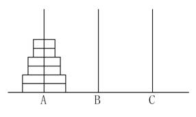

**Hanoi Twin Towers**

**Problem description**

Given three thin pillars of sufficient length, A, B, and C, place 2n disks with holes in the middle on pillar A. These disks have n different sizes, each size has two identical disks. Note that the two disks are not discriminated (The figure below is for n=3).

These disks are now to be moved to the pillar C, which can be temporarily stored on the pillar B during the movement. Requirements :

(1) Only allowed to move one disk at a time;

(2) The disks on A, B, C three pillars must maintain the order of small to large;

Task: let A~n~ be the minimum number of moves required by moving 2n disks to complete the above task, for the input n, output A~n~.

**Input**

The input file contains a positive integer n, indicating that 2n disks are placed on pillar A.

**Output**

The output file contains a positive integer as the minimum number of moves A~n~ required to complete the above task.

**Sample Input 1**

1

**Sample Output 1**

2

**Sample Input 2**

2

**Sample Output 2**

6

**Restriction**

For 50% of the data, 1 ≤ n ≤ 25

for 100% of the data, 1 ≤ n ≤ 200

**Hint**

Try to establish the recursive relation between A~n~ and A~n-1~.
