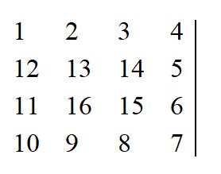

**Helix Matrix**

**Problem Description**

A helix matrix with n rows and n columns can be generated as follows:

Start at the top-left corner of the matrix (row 1, column 1) and initially move to the right. If the grid ahead is somewhere you have not passed yet, move on, otherwise turn right. Repeat until you have passed all the grids in the matrix. Then, fill in 1, 2, 3,\... n2 in the order you go through the grids, and a helix matrix is formed.

The following figure shows the helix matrix when n=4.

Given the size of the matrix n and number i and j, please find the number in row i, column j of this matrix.

**Input**

The input contains three integers n, i, and j in a line separated by spaces, respectively indicating the size of the matrix and the row and the column of the number to be evaluated.

For 50% of the data, 1 ≤ n ≤ 100;

For 100% of the data, 1 ≤ n ≤ 30,000, 1 ≤ i ≤ n, 1 ≤ j ≤ n.

**Output**

There is only one line containing an integer that represents the number in row i, column j in the corresponding matrix.

**Sample Input**

4 3 2

**Sample Output**

14
