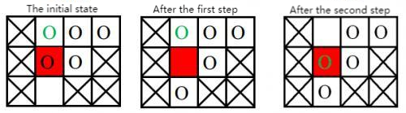
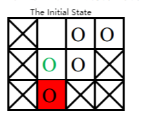

**Huarong Road**

**Problem Description**

B is obsessed with the game called Huarong Road recently, but it always takes him a long time to finish it once. So, he thought of using programming to complete Huarong Road: given a situation, whether Huarong Road can not be completed. If it can be completed, how much time is the least needed?

The Huarong road played by B is slightly different from the classic Huarong Road game. The rules of the game are as follows:

1\. There are n × m squares on an n × m board, of which one and only one square is blank, and the other n × m-1 squares have a piece on each square, and the size of each piece is 1 × 1;

2\. Some pieces are fixed and some pieces can be moved;

3\. Any piece on a square that is adjacent to a blank square (with a common edge) can be moved onto a blank square.

The goal of the game is to move a movable piece in a given position to the goal position.

Given a board, the game can be played q times. Of course, each time the fixed pieces on the board do not change, but the initial position of the blank square on the board, the initial position of the specified movable pieces, and the goal position may be different. On the i~th~ play, the blank square is in column EY~i~, row EX~i~, the initial position of the specified movable piece is in column SY~i~, row SX~i~, and the goal position is in column TY~i~, row TX~i~.

Assume that B is able to move the piece once per second, and the rest of the time is negligible. Please tell B the minimum amount of time each play will take, or tell him that it is impossible to complete the game.

**Input**

The first line has 3 integers separated by a space for n, m, q;

The next n lines describe an n × m board with m integers in each row, separated by a space, each integer describing the state of a square on the board, with 0 indicating that the piece on that square is fixed and 1 indicating that the piece on that grid can be moved or that the grid is empty.

The next q lines, each containing 6 integers: EX~i~, EY~i~, SX~i~, SY~i~, TX~i~, TY~i~, separated by a space between every two integers, indicating the position of the blank square in each game, specifying the initial position and the goal position of the specific chess piece.

**Output**

There are q lines, each containing 1 integer indicating the minimum amount of time needed to play each game, and output −1 if the goal is impossible to achieve in one game.

**Sample Input**

3 4 2

0 1 1 1

0 1 1 0

0 1 0 0

3 2 1 2 2 2

1 2 2 2 3 2

**Sample Output**

2

-1

**Hint**

**\[Explanation of Sample\]**

The squares with crosses on the board are fixed, the red squares are the target positions, the circles represent the pieces, and the green circles represent the target piece.

1\. For the first game, the initial position of the blank square is (3, 2) (shown by the blank in the picture), and the goal of the game is to move the piece (represented by the green circle in the picture), which is initially placed on (1, 2), to the goal position (2, 2) (the red grid in the picture).

The moving process is as follows:

2\. For the second game, the initial position of the blank grid is (1, 2) (shown by the blank in the picture), and the goal of the game is to move the piece (shown by the green circle in the picture) whose initial position is on (2, 2) to the goal position (3, 2).

To move the target square to the target location, we must first move the blank piece to the target location. To move the blank piece to the target position, it must exchange positions with the current piece on the target location from its current location (2, 2). Then the only piece that can then exchange positions with the blank piece is the piece at the target position in the current diagram. So the target piece can never go to its target position. The game cannot be completed.

**\[Data Range\]**

For 30% of the data, 1 ≤ n, m ≤ 10, q = 1;

For 60% of the data, 1 ≤ n, m ≤ 30, q ≤ 10;

For 100% of the data, 1 ≤ n, m ≤ 30, q ≤ 500.
