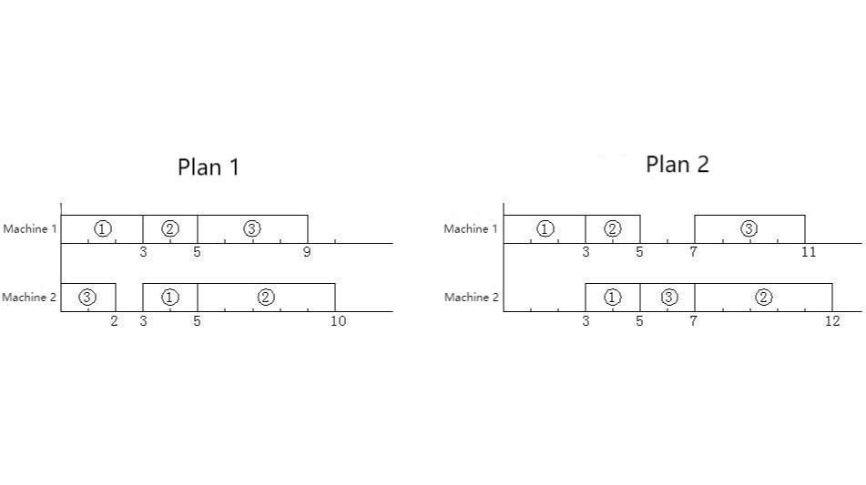

**Job Scheduling Plan**

**Problem description**

We are now going to use m machines to process n workpieces, each workpiece has m processes, each process is done on a different designated machine. Each process of each workpiece has a specified processing time.

Each process of each workpiece is called an operation, we use the notation j-k to denote an operation, where j is a number from 1 to n, indicates the workpiece number; k is a number from 1 to m, indicates a process number. For example, 2-4 represents this operation is the 4^th^ process of the 2^nd^ workpiece. In this case, we are also given a schedule for the operations.

For example, when n=3 and m=2, "1-1, 1-2, 2-1, 3-1, 3-2, 2-2" is a given schedule, that is, first arrange the 1^st^ process of the 1^st^ workpiece, then the 2^nd^ process of the 1^st^ workpiece, then the 1^st^ process of the 2^nd^ workpiece, and so on.

On the one hand, the schedule of each operation must satisfy the following two constraints.

1. For the same workpiece, each process must begin after the previous process has been completed;
2. Each machine can only process one workpiece at most at the same time.

On the other hand, the working state of previous scheduled operation cannot be changed when schedule a later operation.

Since the same workpiece is scheduled in the order of the process, the same schedule can still be obtained by only giving the workpiece number in the original order. Therefore, in the input data, we abbreviate this schedule as "1 1 2 3 3 2".

Also note that schedule only requires that each operation be scheduled in a given order. Not necessarily the actual sequence of operations on each machine. In practice, it is possible that one of the next operations is completed before one of the first.

For example, taking n=3, m=2, the known data is as follows:

---

  Workpiece Number   Workpiece Number/ Processing Time
    Process1                            Process2
  1                  1/3                                 2/2
  2                  1/2                                 2/5
  3                  2/2                                 1/4

---

Then for the schedule "1 1 2 3 3 2", both solutions in the figure below are correct. But the total time required is 10 and 12, respectively.

When an operation is inserted into a slot on a machine (the last part that has not been scheduled for an operation can also be considered a slot), it can be inserted forward, backward, or centered. To make the problem simpler, let's make a convention: Insert as far ahead as possible, subject to constraints (1) and (2). Moreover, we also agree that if more than one slot can be inserted, insert into the first slot, subject to constraints (1) and (2). Thus, under these conventions, plan 1 in the above example is correct and plan 2 is incorrect.

Obviously, under these conventions, for a given schedule, the solution that conforms to this arrangement order is unique. Please calculate the total time required for the solution to complete all tasks.

**Input**

The first line of the input file is two positive integers m, n, separated by a space, (where m (\<20) represents the number of machines and n (\<20) represents the number of workpieces)

The second line: m × n numbers separated by spaces, in the given order.

For the next 2n lines, each line contains m positive integers separated by spaces, each number up to 20.

The first n lines in turn represent the machine number used for each process of each workpiece, the first number is the machine number of the first process, the second number is the machine number of the second process, and so on.

The last n lines represent the processing time of each process of each workpiece in turn.

T

he above data are guaranteed to be correct, no need to check.

**Output**

A positive integer, which is the minimum processing time.

**Sample Input**

2 3

1 1 2 3 3 2

1 2

1 2

2 1

3 2

2 5

2 4

**Sample Output**

10
