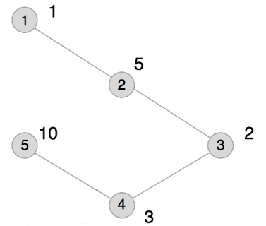

**Joint Weights**

**Problem Description**

An undirected connected graph G has n points and n-1 edges. The points are numbered from 1 to n. The point numbered i has weight W~i~, and the length of each edge is 1. The distance between two points (u, v) on the graph is defined as the shortest distance from point u to point v. For a pair of points (u, v) on a graph G, if their distance is 2, they will have a joint weight of W~v~×W~u~.

What is the largest joint weight among all ordered pairs of points on G that can produce a joint weight? What is the sum of all the joint weights?

Input

The first line contains one integer n.

Next n-1 lines each contain 2 positive integers u and v separated by a space, indicating that the points numbered u and v are connected by an edge.

The last line contains n positive integers separated by a space, where the i~th~ integer indicates that the weight of the point numbered i on the graph G is W~i~.

Output

The output consists of 1 line which contains 2 integers, separated by a space. The two integers are the maximum of the joint weights on graph G and the sum of all the joint weights. Since the sum of all the joint weights can be large, please mod 10007 when you print it out.

Sample Input

5

1 2

2 3

3 4

4 5

1 5 2 3 10

Sample Output

20 74

Hint

The plot entered for this example is shown above, and the ordered pairs of points at distance 2 are (1,3), (2,4), (3,1), (3,5), (4,2), and (5,3).

Their joint weights are 2, 15, 2, 20, 15, and 20, respectively. The largest of these is 20, and the sum is 74.

\[Data Range\]

For 30% of the data, 1 \< n ≤ 100;

For 60% of the data, 1 \< n ≤ 2000;

For 100% of the data, 1 \< n ≤ 200,000 and 0 \< W~i~ ≤ 10000.

It is guaranteed that there must exist ordered pairs of points that can produce joint weights.
