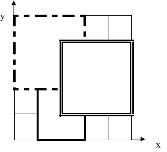

**Lay the carpet**

**Problem Description**

To prepare for a unique award ceremony, organizers covered a rectangular area of the venue (which can be thought of as the first quadrant of a rectangular coordinate system) with rectangular carpets. There are n carpets, numbered from 1 to n. Now lay these carpets parallel to the axis in order of number from smallest to largest. The carpet that is laid later overlays the carpet that has been laid before.

Once all the carpets have been laid, the organizer wants to know the serial number of the top carpet that covers a certain point on the ground. Note: Points on the boundary of the rectangular carpet and the four vertices count as covered by the carpet.

**Input**

There are a total of n+2 lines.

The first line, an integer n, means there are n carpets in total.

In the next n lines, row i+1 represents information about carpet i. It contains four integers a, b, g and k, respectively representing the coordinate of the lower left corner of the carpet (a,b) and the length of the carpet in the X-axis and Y-axis directions. Every two integers are separated by spaces.

The n+2 line contains two integers x and y, which represent the coordinate of a certain point on the ground (x,y).

**Output**

The output has 1 line, containing an integer that represents the serial number of the desired carpet; if the certain point is not covered by any carpet, then output -1.

**Sample Input 1**

3

1 0 2 3

0 2 3 3

2 1 3 3

2 2

**Sample Output 1**

3

**Sample Input 2**

3

1 0 2 3

0 2 3 3

2 1 3 3

4 5

**Sample Output 2**

-1

**Instruction/Hint**

**\[Explanation of Sample 1\]**

In the figure below, carpet 1 is represented by the solid line, carpet 2 is represented by the dashed line, and carpet 3 is represented by the double solid line. The top carpet covering point (2,2) is carpet 3.

**\[Data Range\]**

For 30% of the data, n≤2.
For 50% of the data, 0≤ a,b,g,k≤100.
For 100% of the data, 0≤n≤10^4^, 0≤a,b,g,k≤10^5^.
