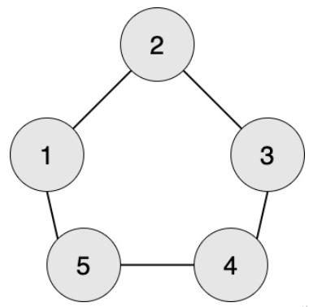

**Machining Parts**

**Problem Description**

Kaikai's factory is methodically producing a kind of magical parts, and the production process of the magical part is also magical. There are n workers in the factory and they are numbered from 1 to n. Some workers have two-way conveyor belts for parts. Ensure that there is no more than one conveyor belt between each two workers.

If worker x wants to produce a part of stage L (L\>1), then **all** workers **directly** connected with worker x by the conveyor belts will need to produce a part that has been processed to stage L−1 (but worker x himself **does not need to** produce parts with stage L−1).

If worker x wants to produce a part of stage 1, **all** workers **directly** connected to worker x by the conveyor belts will need to provide worker x with a raw material.

Xuanxuan is worker No. 1. Now q orders are given. The i^th^ order indicates that the worker ai wants to produce a part of stage L~i~. Xuanxuan wants to know if he has to supply someone with raw materials for each work order. He knows you're smart enough to figure it out for him!

**Input**

The first line contains three positive integers, n, m, and q, representing the number of workers, the number of conveyor belts, and the number of work orders respectively.

For the next m lines, there are two positive integers u and v in each line, representing that there is a conveyor belt between worker u and worker v. It is ensured that u≠v.

For the next q lines, there are two positive integers a and L in each line, representing that work a wants to produce a part of stage L.

**Output**

There are q lines, and every line has a string of "Yes" or "No". If Xuanxuan, as worker 1, needs to supply raw materials when following order i, then output "Yes" in line i; otherwise, output "No" in line i. Note that the output **do not contain** quotation marks.

**Sample Input 1**

3 2 6

1 2

2 3

1 1

2 1

3 1

1 2

2 2

3 2

**Sample Output 1**

No

Yes

No

Yes

No

Yes

**Sample Input 2**

5 5 5

1 2

2 3

3 4

4 5

1 5

1 1

1 2

1 3

1 4

1 5

**Sample Output 2**

No

Yes

No

Yes

Yes

**Hint**

**\[Explanation of Sample 1\]**

Worker 1 wants to produce parts of stage 1, and worker 2 is required to provide raw materials.

Worker 2 wants to produce parts of stage 1, and worker 1 and 3 are required to provide raw materials.

Worker 3 wants to produce parts of stage 1, and worker 2 is required to provide raw materials.

Worker 1 wants to produce parts of stage 2, and worker 2 is required to produce parts of stage 1, and worker 1 and 3 are required to produce raw materials.

Worker 2 wants to produce parts of stage 2, and worker 1 and 3 are required to produce parts of stage 1, and worker 2 is required to produce raw materials for both of them.

Worker 3 wants to produce parts of stage 2, and worker 2 is required to produce parts of stage 1, and worker 1 and 3 are required to produce raw materials.

**\[Explanation of Sample 2\]**

Worker 1 wants to produce parts of stage 1, and worker 2 and 5 are required to provide raw materials.

Worker 1 wants to produce parts of stage 2, and worker 2 and 5 are required to provide parts of stage 1, and workers 1, 3, and 4 are required to provide raw materials.

Worker 1 wants to produce parts of stage 3, and worker 2 and 5 are required to provide parts of stage 2, and workers 1, 3, and 4 are required to provide parts of stage 1, and workers 2, 3, 4, and 5 are required to provide raw materials.

Worker 1 wants to produce parts of stage 4, and worker 2 and 5 are required to provide parts of stage 3, and workers 1, 3, and 4 are required to provide parts of stage 2, and workers 2, 3, 4, and 5 are required to provide parts of stage 1, all workers should provide raw materials.

Worker 1 wants to produce parts of stage 5, and worker 2 and 5 are required to provide parts of stage 4, and workers 1, 3, and 4 are required to provide parts of stage 3, and workers 2, 3, 4, and 5 are required to provide parts of stage 2, and all workers should provide parts of stage 1, and all workers should provide raw materials.

**\[Data Scale and Constraints\]**

There are 20 test points in total.

1 ≤ u, v, a ≤ n.

For test points 1\~4, 1 ≤ n, m ≤ 1000, q=3, L=1.

For test points 5\~8, 1 ≤ n, m ≤ 1000, q=3, 1 ≤ L ≤ 10.

For test points 9\~12, 1 ≤ n, m, L ≤ 1000, 1 ≤ q ≤ 100.

For test points 13\~16, 1 ≤ n, m, L ≤ 1000, 1 ≤ q ≤ 10^5^.

For test points 17\~20, 1 ≤ n, m, q ≤ 10^5^, 1 ≤ L ≤ 10^9^.
