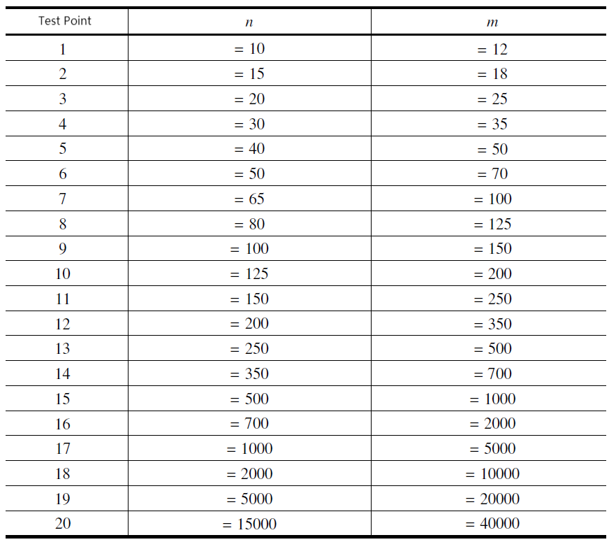

**Magic Circle**

**Problem Description**

The magic war is about to begin once in sixty years, and the great wizard prepares to draw magical energy from the nearby magic field.

The great wizard has m magic items, numbered 1, 2,\..., m. Each item has a magic value. We use Xi to represent the magic value of the magic item numbered i. Each magic value Xi is a positive integer that does not exceed n, and there may be multiple items with the same magic value.

The great wizard holds that if and only if four magic items numbered a, b, c, and d satisfy Xa\<Xb\<Xc\<Xd, Xb−Xa=2(Xd−Xc) and Xb−Xa\<(Xc−Xb)/3, these four magic items form a magic circle, and he calls these four magic items respectively item A, item B, item C, and item D of this magic circle.

Now, the wizard wants to know, for each magic item, the number of times it appears as item A in a certain magic circle, the number of times it appears as item B, the number of times it appears as item C, and the number of times it appears as item D.

**Input**

The first line contains two positive integers n and m separated by a space.

For the next m lines, each line has a positive integer, and the positive integer in the i+1 line represents Xi, that is, the magic value of the item numbered ii.

It is ensured that 1≤ n≤ 15000, 1≤m≤40000, 1≤Xi≤n. Each Xi is randomly generated with equal probability within the legal range.

**Output**

There are m lines, and each line contain 4 integers. The four integers in the i^th^ line each represents the number of times that item i appears as a, b, c and d.

Ensure that every number in the standard output does not exceed 10^9^. Two adjacent numbers in each line are separated by exactly one space.

**Sample Input 1**

30 8

1

24

7

28

5

29

26

24

**Sample Output 1**

4 0 0 0

0 0 1 0

0 2 0 0

0 0 1 1

1 3 0 0

0 0 0 2

0 0 2 2

0 0 1 0

**Hint**

**Sample Input 2**

15 15
1
2
3
4
5
6
7
8
9
10
11
12
13
14
15

**Sample Output 2**

5 0 0 0
4 0 0 0
3 5 0 0
2 4 0 0
1 3 0 0
0 2 0 0
0 1 0 0
0 0 0 0
0 0 0 0
0 0 1 0
0 0 2 1
0 0 3 2
0 0 4 3
0 0 5 4
0 0 0 5

**\[Explanation of Sample 1\]**

There are 5 magic circles in total, which are:

Items 1,3,7, and 6 with magic value of 1,7,26,29.

Items 1,5,2, and 7 with magic value of 1,5,24,26.

Items 1,5,7, and 4 with magic value of 1,5,26,28.

Items 1,5,8, and 7 with magic value of 1,5,24,26.

Items 5,3,4, and 6 with magic value of 5,7,28,29.

Take item 5 for example, it appears once as item a, three times as item b, and does not appear as item c nor item d. Therefore, the four numbers in this line are 1,3,0,0.

Furthermore, if we view the output as a matrix with m rows and 4 columns, the sum of the m numbers in each column should equal the total number of magic circles. So, if your output does not satisfy this feature, then your output must be incorrect. You can check the correctness of your output to some extent by using this feature.

**\[Data Size\]**

