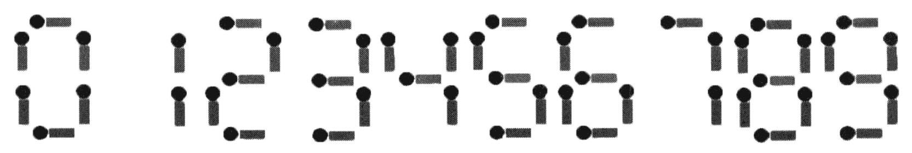

**Matchstick Equation**

**Problem description**

Given n matchsticks, how many equations of the form "A+B=C" can you make? In the equation, A, B, and C are integers made out of matchsticks (if the number is not zero, the highest digit cannot be zero). The numbers 0-9 could be made with matchsticks as shown in the picture:

Note:

1\. The plus sign and the equal sign each need two matchsticks.

2\. If A≠B, then A+B=C and B+A=C are regarded as different equations (A, B, C ≥ 0).

3\. All n matchsticks must be used.

**Input**

An integer n (1 ≤ n ≤ 24).

**Output**

The output file has one integer indicating the number of different equations that can be spelled.

**Sample Input 1**

14

**Sample Output 1**

2

**Sample Input 2**

18

**Sample Output 2**

9

Hint

**\[Explanation of Sample 1\]**

The two equations are 0+1=1 and 1+0=1.

**\[Explanation of Sample 2\]**

The 9 equations are:

0 + 4 = 4

0 + 11 = 11

1 + 10 = 11

2 + 2 = 4

2 + 7 = 9

4 + 0 = 4

7 + 2 = 9

10 + 1 = 11

11 + 0 = 11
