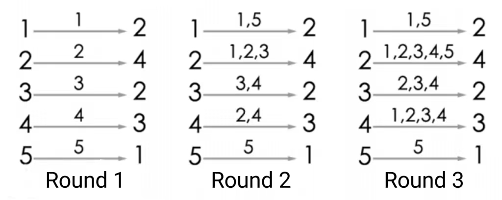

**Message Passing**

**Problem Description**

There are N students (numbered from 1 to N) playing a game of message passing. In the game, each student has a fixed message passing target, where the message passing target of the student numbered i is the student numbered Ti.

At the beginning of the game, everyone only knows his or her own birthday. Later in each round, everyone will simultaneously tell their current birthday information to each other (note: someone may be able to get information from several people, but each person will only give information to one person, which is their target). The game ends when someone gets their date of birth from someone else. How many rounds can the game be played?

**Input**

There are two lines.

The first line contains one positive integer n for n people.

The second line contains n positive integers T~1~, T~2~, \..., T~n~, where the i^th^ integer T~i~ denotes that the student numbered Ti is the message passing target of the student numbered i, T~i~ ≤ n and T~i~ ≠ i.

**Output**

There is one integer indicating how many rounds the game can play in total.

**Sample Input**

5

2 4 2 3 1

**Sample Output**

3

**Hint**

**\[Explanation of the Sample\]**

The game's process is shown in the figure. After playing round 3, player 4 will hear player 2 tell him his own birthday, so the answer is 3. Of course, after the third round, player 2 and player 3 will both know their birthdays from their sources, so they are also eligible for the end of the game.

For 30% of the data, n ≤ 200;

For 60% of the data, n ≤ 2500;

For 100% of the data, n ≤ 200,000.
