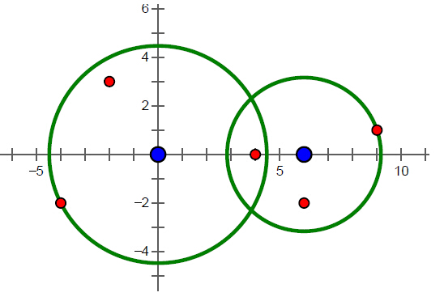

# 导弹拦截

## 题目描述

经过 $11$ 年的韬光养晦，某国研发出了一种新的导弹拦截系统，凡是与它的距离不超过其工作半径的导弹都能够被它成功拦截。当工作半径为 $0$ 时，则能够拦截与它位置恰好相同的导弹。但该导弹拦截系统也存在这样的缺陷：每套系统每天只能设定一次工作半径。而当天的使用代价，就是所有系统工作半径的平方和。

某天，雷达捕捉到敌国的导弹来袭。由于该系统尚处于试验阶段，所以只有两套系统投入工作。如果现在的要求是拦截所有的导弹，请计算这一天的最小使用代价。

## 输入格式

第一行包含 $4$ 个整数 $x_1,y_1,x_2,y_2$，每两个整数之间用一个空格隔开，表示这两套导弹拦截系统的坐标分别为 $(x_1,y_1), (x_2,y_2)$。第二行包含 $1$ 个整数 $N$，表示有 $N$ 颗导弹。接下来 $N$ 行，每行两个整数 $x,y$，中间用一个空格隔开，表示一颗导弹的坐标 $(x,y)$。不同导弹的坐标可能相同。

## 输出格式

一个整数，即当天的最小使用代价。

## 样例 #1

### 样例输入 #1

```
0 0 10 0
2
-3 3
10 0
```

### 样例输出 #1

```
18
```

## 样例 #2

### 样例输入 #2

```
0 0 6 0
5
-4 -2
-2 3
4 0
6 -2
9 1
```

### 样例输出 #2

```
30
```

## 提示

两个点 $(x_1,y_1),(x_2,y_2)$ 之间距离的平方是 $(x_1-x_2)^2+(y_1-y_2)^2$。

两套系统工作半径 $r_1,r_2$ 的平方和，是指 $r_1,r_2$ 分别取平方后再求和，即 $r_1^2+r_2^2$。

### 样例 1 说明

样例 $1$ 中要拦截所有导弹，在满足最小使用代价的前提下，两套系统工作半径的平方分别为 $18$ 和 $0$。

### 样例 2 说明

样例 $2$ 中的导弹拦截系统和导弹所在的位置如下图所示。要拦截所有导弹，在满足最小使用代价的前提下，两套系统工作半径的平方分别为 $20$ 和 $10$。



【数据范围】。

- 对于 $10\%$ 的数据，$N=1$。
- 对于 $20\%$ 的数据，$1\le N\le 2$。
- 对于 $40\%$ 的数据，$1\le N\le 100$。
- 对于 $70\%$ 的数据，$1\le N\le 1000$。
- 对于 $100\%$ 的数据，$1\le N\le 10^5$，且所有坐标分量的绝对值都不超过 $1000$。
