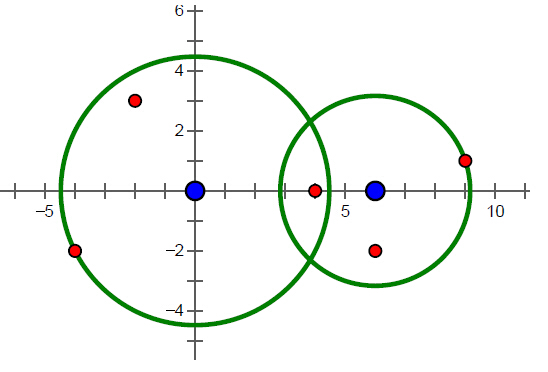

**Missile Interception**

**Problem Description**

After 11 years of keeping a low profile, a certain country has developed a new missile interception system, which can successfully intercept all missiles whose distance does not exceed its working radius. When the working radius is 0, the missile can be intercepted at exactly the same position as it. However, the missile interception system has such a defect: each system can only set the working radius once a day. The use cost of the day is the sum of the squares of the working radius of all systems. 

One day, the radar caught an enemy missile attack. Since the system is still in the experimental stage, only two systems are in operation. If the current requirement is to intercept all missiles, please calculate the minimum use cost for this day.

**Input **

The first line contains 4 integers x1, y1, x2, and y2, separated by a space between every two integers, indicating that the coordinates of the two sets of missile interception systems are (x1, y1) and (x2, y2) respectively. 

The second line contains an integer N, which means there are N missiles. In the next N lines, each line contains two integers x and y, separated by a space, indicating the coordinates (x, y) of a missile. The coordinates of different missiles may be the same.

**Output  **

The output is only one line and contains an integer, which is the minimum usage cost of the day.

**Sample Input**

0 0 10 0

2

-3 3

10 0

**Sample Output**

18

**Hint**

**Sample Input 2**

0 0 6 0

5

-4 -2

-2 3

4 0

6 -2

9 1

**Sample Output 2**

30

The squared distance between two points (x1, y1) and (x2, y2) is (x1-x2) \^2+ (y1-y2) \^2. 

The sum of squares of the working radii r1 and r2 of the two systems refers to the sum of the squares of r1 and r2, namely r1 \^2+ r2 \^2

**\[Explanation of sample 1\]**

In sample 1 to intercept all missiles, the squares of the working radii of the two systems are 18 and 0, respectively, under the premise of meeting the minimum cost of use.

**\[Explanation of sample 2\] **

The missile interception system and the location of the missile in sample 2 are shown in the figure below. To intercept all missiles under the premise of meeting the minimum cost of use, the squares of the working radii of the two systems are 20 and 10 respectively.

\_256" />{width="5.708333333333333in" height="3.875in"}

**\[Constraints\] **

For 10% of the data, N = 1 
For 20% of the data, 1 ≤ N ≤ 2 
For 40% of the data, 1 ≤ N ≤ 100 
For 70% of the data, 1 ≤ N ≤ 1000 
for 100% of the data, 1 ≤ N ≤ 100000, and the absolute value of all coordinate components does not exceed 1000.
