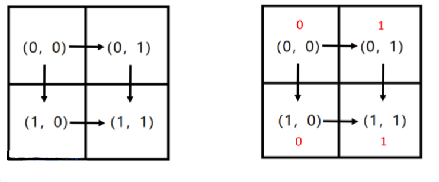
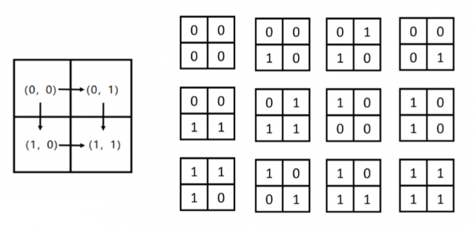
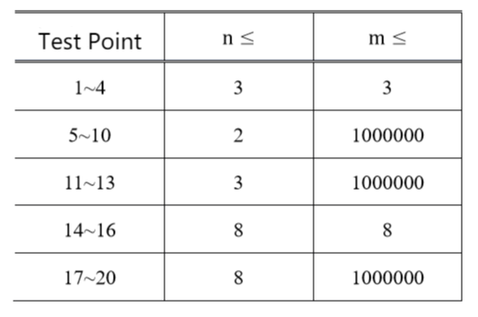

**Number-Filling Game**

**Problem Description**

D especially likes to play games. On this day, he was playing a number-filling game.

The board for this number-filling game is an n×m rectangular table. Players need to fill in a number (either the number 0 or the number 1) in each grid of the table, and some restrictions need to be met when filling in the number.

Let's describe these limitations in detail.

For ease of description, let's first give some definitions:

\- We denote a grid by the row-column coordinates of each grid, i.e. (row coordinates, column coordinates). (Note: row and column coordinates are numbered from 0)

\- Legal path P: A path is legal if and only if:

1. This path starts from the top-left grid of the rectangular form (0,0) and ends at the bottom-right grid of the rectangle (n-1, m-1);
2. In this path, you can only move from the current grid to the grid on the right, or from the current grid to the grid below.

For example: in the following rectangle, the only two paths that are legal are P~1~: (0,0) → (0,1) → (1,1) and P~2~: (0,0) → (1,0) → (1,1).

A valid path P can be represented by a string w(P) of length n + m - 2 containing only the character "R" or the character "D". The i^th^ character records the move method at step i in the path P. "R" means to move to the neighboring grid to the right of the current grid, and "D" means to move to the neighboring grid below the current grid. For example, for path P~1~ in the figure above, there is w(P~1~) = "RD"; And for another path P~2~, we have w(P~2~) = "DR".

At the same time, after concatenating the numbers filled in each grid of each legal path P, a 01 string of length n + m - 1 will be obtained, denoted as s(P). For example, if we fill in the number 0 on the grids (0,0) and (1,0) and the number 1 on the grids (0,1) and (1,1) (see the red number above), then for path P~1~, we get s(P~1~) = "011", and for path P~2~, we get s(P~2~) = "001".

The game asks D to find a way to fill in the numbers 0 and 1 so that for two paths P~1~ and P~2~, if w(P~1~) \> w(P~2~), then s(P~1~) ≤ s(P~2~). We say that string a is smaller than string b if and only if the lexicographic order of string a is less than that of string b. See Problem 1 for the definition of lexicographic order. But finding only one method isn't enough to satisfy D's curiosity. D wants to know how many ways to play the game, that is, how many ways to fill in numbers are there to satisfy the requirements of the game.

D is limited in his ability, so he would like you to help him solve the problem: how many different ways could D fill in the numbers that satisfy the requirement of the game? Since the answer is likely to be large, you will need to output the answer modulo 10^9^ + 7.

**Input**

The input file is only one line and contains two positive integers n and m separated by a space, indicating the size of the rectangle, where n represents the number of rows and m represents the number of columns of the rectangular form.

**Output**

The output is only one line and contains a positive integer indicating how many ways you can fill in 0 and 1 for the game. Note: Output the answer modulo 10^9^+7.

**Sample Input 1**

2 2

**Sample Output 1**

12

**Sample Input 2**

3 3

**Sample Output 2**

112

**Sample Input 3**

55

**Sample Output 3**

7136

**Hint**

**\[Explanation of the Samples\]**

**\[Data Range and Conventions\]**

