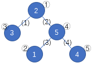
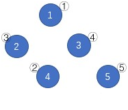

**Numbers on the Tree**

**Problem Description**

Given a tree of size n with n nodes and n−1 edges, the nodes are numbered from 1 to n. Initially, each node has a number from 1 to n, and each number from 1 to n occurs in **exactly** one node.

Then you need to perform **exactly** n-1 edge-deleting operations, each time you need to pick an **undeleted** edge, in which case the numbers on the two nodes connected by the edge will be **swapped**, and this edge will be deleted.

After n−1 operations, all edges will be deleted. In this case, the nodes where the numbers 1 to n reside are arranged in ascending order of these numbers, and we will get a permutation P~i~ of the serial numbers of the nodes. Now find the P~i~ with **the least lexicographical order** that you can get under the optimal operation.

In the figure above, the numbers 1 to 5 in the blue circle were at nodes ②, ①, ③, ⑤, and ④, respectively at the beginning. Delete all edges in the order of (1), (4), (3), (2), and the tree becomes the figure below. The serial numbers of the nodes obtained in numerical order are arranged as ①③④②⑤, which has the least lexicographic order of all possible results.

**Input**

**The input contains multiple sets of test data.**

There is one positive integer T in the first line, representing the number of data groups.

For each set of test data:

There is one integer n in the first line, representing the size of the tree.

There are n integers in the second line, and the i^th^ (1 ≤ i ≤ n) integer indicates the serial number of the node where the number i is initially located.

There are two integers x and y in each line of the next n−1 lines, representing the edge connecting node x to node y.

**Output**

For each set of test data, output a line of n integers separated by spaces, representing the P~i~ with the lowest lexicographic order that can be obtained under the optimal operation scheme.

**Sample Input**

4

5

2 1 3 5 4

1 3

1 4

2 4

4 5

5

3 4 2 1 5

1 2

2 3

3 4

4 5

5

1 2 5 3 4

1 2

1 3

1 4

1 5

10

1 2 3 4 5 7 8 9 10 6

1 2

1 3

1 4

1 5

5 6

6 7

7 8

8 9

9 10

**Sample Output**

1 3 4 2 5

1 3 5 2 4

2 3 1 4 5

2 3 4 5 6 1 7 8 9 10

**Hint**

**\[Data Range\]**

---

  Test Point   n≤     Special Qualities
  1∼2          10     None
  3∼4          160    The shape of the tree is a chain
  5∼7          2000   Ditto
  8∼9          160    There exist nodes with n−1 degree
  10∼12        2000   Ditto
  13∼16        160    None
  17∼20        2000   None

---

For all test points: 1 ≤ T ≤ 10, and it is guaranteed that a tree is given.
