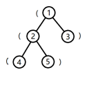
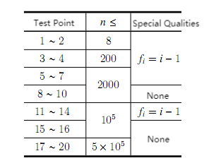

**Parentheses Tree**

**Problem Background**

Here's the definition of a **legal** parentheses **string** :

1\. '()' is a legal parentheses string.

2\. If 'A' is a legal parentheses string, then '(A)' is a legal parentheses string

3\. If 'A' and 'B' are legal parentheses strings, then 'AB' is a legal parentheses string.

Here's the definition of a **substring** and a **different substring**:

1\. A substring of a string 'S' is a string of **consecutive** characters in 'S'. The substring of 'S' could be represented by the start l and the end r, denoted as S (l, r) (1 ≤ l ≤ r ≤ \|S\|, \|S\| represents the length of S).

2\. Two substrings of 'S' are considered different **if and only if** they have different positions in 'S', i.e., different l or different r.

Problem Description

A tree of size n contains n nodes and n−1 edges, each edge connecting two nodes, and there is **only** one simple path between any two nodes that is reachable to each other.

Q is a curious child. One day he met a tree of size n on his way to school. The nodes on the tree are numbered from 1 to n, and node 1 is the root of the tree. Except for node 1, each node has a father node, the father of node u (2 ≤ u ≤ n) is node f~u~ (1 ≤ f~u~ \< u).

Q finds that each node in the tree has **exactly** one parenthesis, which may be '(' or ')'. Q defines s~i~ as: a string of parentheses along a simple path from the root node to node i, in the order of passing the node.

Obviously, s~i~ is a parentheses string, but not necessarily a legal parentheses string, so now Q wants to find out for all i (1≤ i ≤ n), how many **distinct substrings** of s~i~ are **legal parentheses strings**.

Q is not able to answer this question, so he has to ask you for help. Let s~i~ have a total of k~i~ distinct substrings which are legal parenthesis strings, you just need to tell Q the xor sum of all i×k~i,~ i.e.:

(1×k~1~) xor (2×k~2~) xor (3×k~3~) xor\...xor (n×k~n~)

Where xor is the exclusive OR operation.

**Input**

The first line is an integer n, representing the size of the tree.

The second line is a string of parentheses of length n, made up of '(' and ')', with the i^th^ parentheses representing the parentheses on node i.

The third line contains n−1 integers, with the i^th^ (1 ≤ i \< n) integer representing the number of the father of node i+1, f~i\ +1~.

**Output**

Just one line which contains one integer for the answer.

**Sample Input**

5

(()()

1 1 2 2

**Sample Output**

6

**Hint**

**\[Explanation of Sample 1\]**

The shape of the tree is as the following figure:

The string formed by the parentheses from the root node to node 1 in an order of passing is '(', and the number of substrings that are legal parenthesis strings is 0.

The string from the root node to node 2 is '((', and the number of substrings that are legal parenthesis strings is 0.

The string from the root node to node 3 is '()', and the number of substrings that are legal parenthesis strings is 1.

The string from the root node to node 4 is '(((', and the number of substrings that are legal parenthesis strings is 0.

The string from the root node to node 5 is '(()' and the number of substrings that are legal parenthesis strings is 1.

**\[Data Range\]**

