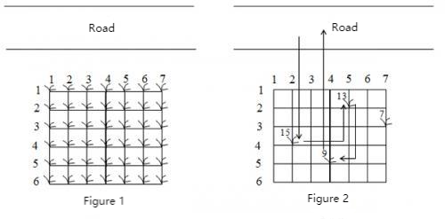

**Peanut Picking**

**Problem Description**

Mr. Robinson has a pet monkey named Duoduo. One day, they were walking along a country road when they noticed a small note posted on a sign: "Welcome to taste my peanuts for free!"

Mr. Robinson and Duoduo are very happy because peanuts are their favorite. Behind the sign, there was a peanut field by the side of the road with peanut plants neatly arranged in a rectangular grid (as shown in Figure 1). The experienced Duoduo can easily tell how many peanuts are in each peanut plant. To practice Duoduo's arithmetic, Mr. Robinson said, "Find the plant that has the most peanuts, and pick its peanuts; then look for the one with the most peanuts in the rest of the plants and pick its peanuts; and so on. But make sure you get back to the roadside within the time I've set."

Let's assume that Duoduo can do one of the four things in each unit of time:

1\) Jump from the roadside to a peanut plant closest to the roadside (i.e. the first row);

2\) Jump from one plant to another adjacent plant;

3\) Pick peanuts from a plant;

4\) Jump back to the roadside from the peanut plant closest to the roadside (the first row).

Now given the size of the peanut field and the distribution of peanuts, how many peanuts can Duoduo pick in a limited time? Note that only some plants may have peanuts in them, assuming that the number of peanuts in those plants varies.

For example, in the peanut field shown in Figure 2, only the plants located in (2,5), (3,7), (4,2) and (5,4) have peanuts, with 13, 7, 15, and 9 peanuts respectively. Along the route shown, Duoduo can pick up to 37 peanuts in 21 units of time.

**Input**

The first line contains three integers, M, N, and K, separated by spaces. This means that the size of the peanut field is M\*N(1≤ M,N ≤20), and the limited time for Duoduo picking peanuts is K(0≤ K ≤1000) units of time. For the next M lines, each line contains N non-negative integers, separated by spaces. The j^th^ integer P~ij~(0≤ P~ij~ ≤500) in line i+1 represents the number of peanuts in the plant (i,j) in the peanut field, and 0 indicates that there are no peanuts in the plant.

**Output**

The output contains a single line containing only one integer, which is the maximum number of peanuts Duoduo can pick under the time limit.

**Sample Input 1**

6 7 21

0 0 0 0 0 0 0

0 0 0 0 13 0 0

0 0 0 0 0 0 7

0 15 0 0 0 0 0

0 0 0 9 0 0 0

0 0 0 0 0 0 0

**Sample Output 1**

37

**Sample Input 2**

6 7 20

0 0 0 0 0 0 0

0 0 0 0 13 0 0

0 0 0 0 0 0 7

0 15 0 0 0 0 0

0 0 0 9 0 0 0

0 0 0 0 0 0 0

**Sample Output 2**

28
