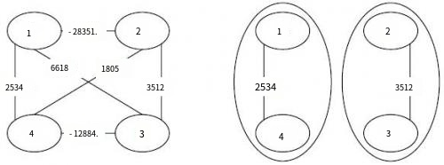

**Prisoners**

**Problem Description**

There are two prisons in S City, which hold a total of N criminals, numbered 1-N respectively. Their relationship was, of course, far from harmonious. Many criminals even have a long history of animosity between each other, that is, if given an opportunity, a conflict may break out at any time. We use the "resentment value" (a positive integer) to indicate the level of animosity between two criminals. And the higher the resentment value, the more animosity between the two criminals. If two criminals with c resentment value are locked up in the same prison, there will be friction between them, resulting in a conflict of c influence.

At the end of each year, the police department will compile a list of all the conflicts in the prison during the year from most influential to least influential, and then report it to Mayor Z in S City. The busy mayor will only look at the impact of the first incident on the list, and if the impact is bad, he will consider replacing the police chief.

After examining the animosity among the N criminals in detail, the police chief found himself under enormous pressure. He plans to redistribute the convicts between the two prisons so that the resulting clashes will have less impact and he will retain his position. If there is any animosity between two criminals in the same prison, they are bound to collide at some point each year.

So how should the criminals be divided so that the conflict Mayor Z saw has the least impact? What is that minimum?

**Input**

There is a space between every two numbers in each line. The first line contains two positive integers, N and M, representing the number of criminals and the number of pairs of criminals who hate each other. Each line of the next M lines contains three positive integers a~j~, b~j~, c~j~, which means that there is hatred between criminals a~j~ and b~j~, and the resentment value is c~j~. The data guarantees that 1\<a~j~ ≤ b~j~ ≤ N, 0 \< c~j~ ≤ 10^9^, and each pair of criminals appears only once.

**Output**

1 line, representing the impact of that conflict seen by Mayor Z. Output '0' if there has been no conflict in the prison this year.

**Sample Input**

4 6

1 4 2534

2 3 3512

1 2 28351

1 3 6618

2 4 1805

3 4 12884

**Sample Output**

3512

**Hint**

**\[Explanation of Sample 1\]**

The resentment values between criminals are shown below on the left, and the distribution of criminals is shown on the right. The impact of conflict events seen by the mayor is 3512 (caused by criminals 2 and 3). No other way of distribution is better than this one.

**\[Data Range\]**

For 30% of the data, there are N ≤ 15.

For 70% of the data, there are N ≤ 2000, M ≤ 50000.

For 100% of the data, there are N ≤ 20000, M ≤ 100000.
