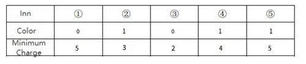

**Select Inns**

**Problem Description**

There are n distinctive inns along the Lijiang River. The inns are numbered from 1 to n according to their location. Each inn is decorated according to one of the colors (k kinds in total, represented by integers 0 to k-1), and each inn has a coffee shop with its minimum charge.

Two tourists travel to Lijiang together. They like the same color and want to try two different inns, so they decide to stay separately in two inns with the same color. In the evening, they decide to choose a cafe to have coffee in. The cafe is required to be located between the two inns they are staying in (including the inn they are staying in), and the minimum charge of the cafe is no more than p.

They want to find out how many options there are to select their inns so that they could find a cafe with a minimum charge of no more than p yuan for the evening.

**Input**

There are n + 1 lines.

In the first line, there are three integers n, k and p, respectively indicating the number of inns, the number of colors, and the highest value of the minimum charge acceptable. Every two integers are separated by a space.

For the next n lines, in line i+1, there are two integers a~i~ and b~i~, separated by a space. a~i~ represents the decoration color of inn i, and b~i~ represents the minimum charge of the cafe in inn i.

**Output**

An integer representing the total number of accommodation options available.

**Sample Input**

5 2 3

0 5

1 3

0 2

1 4

1 5

**Sample Output**

3

**Hint**

**\[Explanation of Sample\]**

If these 2 people want to stay in the inns with the same color, all the options include: staying in inns ①③, ②④, ②⑤, ④⑤. But if they choose to stay in inn 4 and 5, the minimum charge of the cafe between inn 4 and 5 is 4, and the highest minimum cost they can afford is 3 yuan. So the plan ④⑤ does not meet the requirements. Therefore, only the first 3 options are available.

**Data Range**

\- For 30% of data, n ≤100;

\- For 50% of data, n ≤ 1,000;

\- For 100% of data, there are 2 ≤ n ≤ 2 ×10^5^, 1≤ k≤50, 0≤ p≤ 100, 0 ≤ b~i~ ≤ 100.
