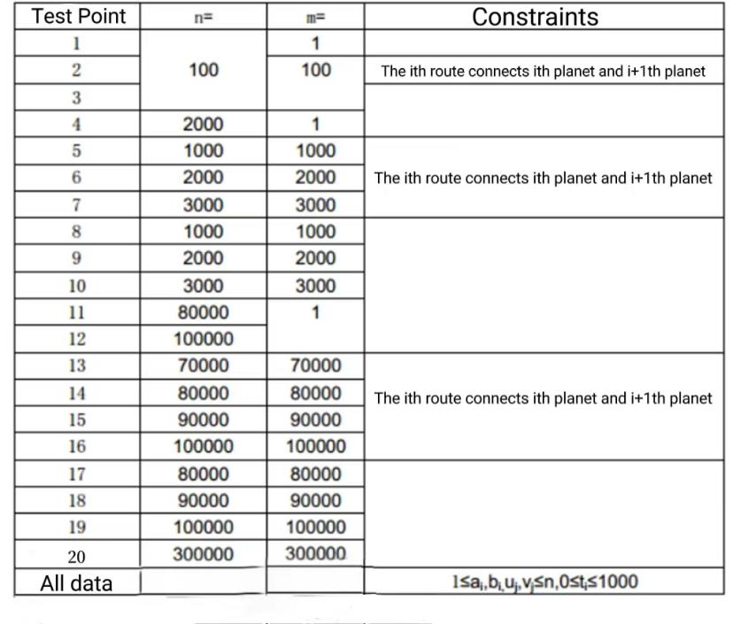

**Shipping Plan**

**Problem Description**

In 2044 AD, humanity entered the cosmic epoch.

There are n planets in country L and n-1 two-way routes, each of which is established between two planets. These n-1 routes connect all the planets in L.

P is in charge of a logistics company. The company has many shipping plans. Each shipping plan is like this: there is a logistics ship that needs to fly from planet U~i~ to planet V~i~ along the fastest space path. Obviously, it takes time for a ship to travel through a route. For route j, it takes t~j~ time for any ship to travel through it, and there is no interference between any two ships.

To encourage scientific and technological innovation, the king of country L agrees to allow P's logistics company to participate in the route construction of country L, that is, allow P to transform a route into a wormhole, and the spaceship will pass through the wormhole without consuming time.

Before the completion of the wormhole construction, P's logistics company pre-connected M transportation plans. After the construction of the wormhole is completed, these m shipping plans will start at the same time, and all ships will depart together. When all the M shipping plans are completed, the stage work of P's logistics company will be completed.

If P is free to choose which channel to transform into a wormhole, try to find out what is the shortest time it takes for P's logistics company to complete the phased work.

**Input**

The first line includes two positive integers n and m, representing the number of planets in country L and the number of shipping plans pre-connected by small P. The planets are numbered from 1 to n.

The next n-1 lines describe the construction of the routes, where line i contains three integers a~i~, b~i~, and t~i~, which means that the two-way route i is built between the two planets a~i~ and b~i~, and it takes t~i~ time for any spacecraft to pass through it.

The next M lines describe the situation of the shipping plan, where the j^th^ line contains two positive integers u~j~ and v~j~, indicating that the j^th^ shipping plan is to fly from planet u~j~ to planet v~j~.

**Output**

There is an integer representing the minimum time it takes for P's logistics company to complete the stage work.

**Sample Input**

6 3

1 2 3

1 6 4

3 1 7

4 3 6

3 5 5

3 6

2 5

4 5

**Sample Output**

11

**Data Range**

The range and characteristics of all test data are shown in the table below:

Be aware of the constant factor effect on program efficiency.

For 100% of the data, guarantee: 1 ≤ a~i~, b~i~ ≤ n, 0 ≤ t~i~ ≤ 1000, 1 ≤ u~i~,v~i~ ≤ n.
