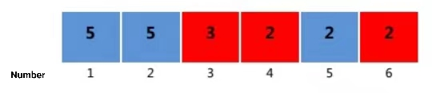

**Sum**

**Problem Description**

A long, narrow strip of paper is evenly divided into n squares, numbered from 1 to n. Each square is colored by color\_i (represented by an integer in \[1,m\]) and a number\_i is written on it.

Now define a special triplet: (x,y,z), where x, y, z represent the number of the square on the tape. The triplet should satisfy the following two conditions:

x, y, z are integers, x\<y\<z, y−x=z−y

colorx=colorz

The score of a triple satisfying the above condition is specified as (x+z)×(number\_x+number\_z). The score of the whole tape is prescribed as the sum of the scores of all triples that satisfy the condition. This score can be quite large; you should output the remainder of the score of the entire tape divided by 10,007.

**Input**

The first row is two positive integers n and m separated by a space, where n represents the number of squares on the tape and m represents the number of types of colors on the tape.

The second row has n positive integers separated by spaces, and the i^th^ number is the number written on the i square on the tape.

The third row has n positive integers separated by spaces, and the i^th^ number indicates the color of the i square on the tape.

**Output**

An integer representing the remainder of the score of the tape divided by 10007.

**Sample Input**

6 2

5 5 3 2 2 2

2 2 1 1 2 1

**Sample Output**

82

**Hint**

**\[Explanation of sample 1\]**

The tape is shown in the figure in the problem description.

All triples that satisfy the condition are: (1, 3, 5), (4, 5, 6).

So the score of the tape is (1+5)×(5+2)+(4+6)×(2+2)=42+40=82.

For the data from group 1 to group 2, 1≤ n≤100, 1≤m≤5;

For the data from group 3 to group 4, 1≤ n≤3000, 1≤m≤100;

For the data from groups 5 to 6, 1≤ n≤100000, 1≤m≤100000, and there is no color with more than 20 occurrences;

For the whole 10 data sets, 1≤n ≤100000, 1≤m≤100000, 1≤color\_i≤ M, 1≤number\_i≤100000.
