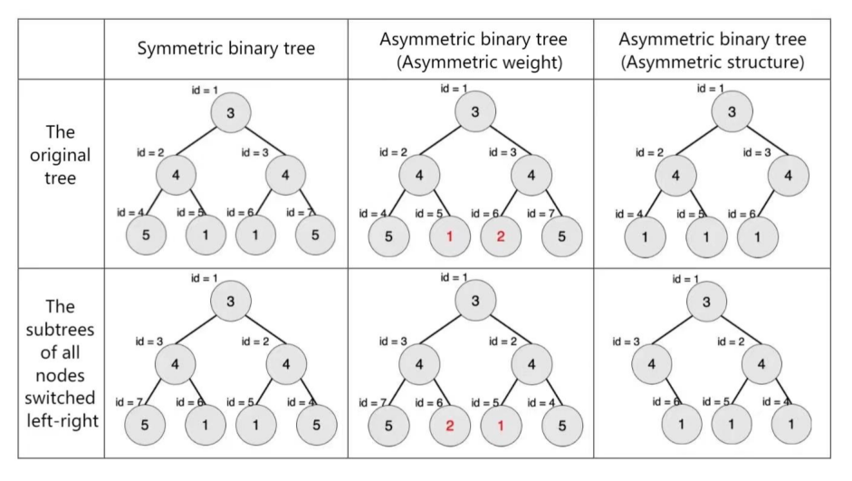
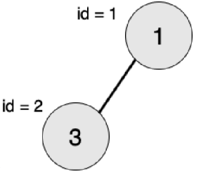
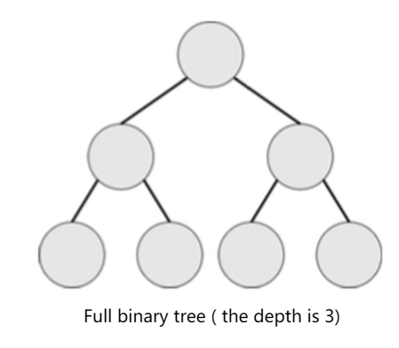
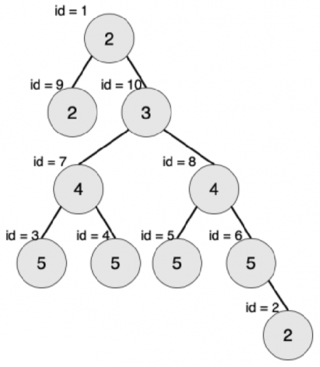

[**Symmetric Binary Tree**](javascript:;)

**Problem description**

A rooted tree with weighted nodes is called a symmetric binary tree if it satisfies the following conditions:

- Binary tree;
- If the left and right subtrees of all nodes in the tree are swapped, the structure and the value of the nodes of the new tree are the same as those of the original tree.

In the following figure, numbers inside nodes represent their weight, and the ids outside the nodes represent the serial number of the nodes.

Given a binary tree, find its symmetric subtree with the most nodes. Please output the number of nodes in this subtree.

Note: A tree with root only is also a symmetric binary tree. In this question, a "subtree" with node T as its sub-root refers to the binary tree formed by node T and all its descendants.

**Input**

The positive integer n (n ≤ 10^6^) in the first line represents the number of nodes in a given tree. The number of nodes ranges from 1 to n, where node 1 is the root of the tree.

The second line contains n positive integers, separated by a space, and the i^th^ positive integer vi represents the weight of node i.

Next n lines, each line contains two positive integers li, and ri, respectively representing the serial number of node i's left and right children. If there is no left/right child, it is denoted by -1. The two numbers are separated by a space.

**Output**

The output is a single line containing an integer representing the number of nodes in the largest symmetric binary subtree of a given tree.

**Sample Input**

2

1 3

2 -1

-1 -1

**Sample Output**

1

**Hint**

The largest symmetric binary subtree is the subtree with node 2 as the root, and the number of nodes is 1.

**Convention:**

Hierarchy: The hierarchy of nodes is defined from the root, which is the first level, and the children of the root are the second level. The level of any node in the tree is equal to the level of its parent node plus one.

Tree depth: The maximum level of nodes in the tree is called the depth of the tree.

Full binary tree: Let the depth of the binary tree be h, if the binary tree has 2h−1 nodes, then this is a full binary tree.

Complete binary tree: Let the depth of the binary tree be h. If except for the h layer, the number of nodes in other layers has reached the maximum number, and all nodes in the h layer are arranged continuously in the leftmost, then this is a complete binary tree.

{width="3.5027777777777778in" height="1.5215277777777778in"}

**Sample Input 2:**

10
2 2 5 5 5 5 4 4 2 3
9 10
-1 -1
-1 -1
-1 -1
-1 -1
-1 2
3 4
5 6
-1 -1
7 8

**Sample Output 2:**

3

**Explanation of Sample 2:**

The largest symmetric binary subtree is a subtree with node 7 as the root and the number of nodes is 3.

**\[Data Scale and Conventions\]**

A total of 25 test points.

v~i~ ≤ 1000.

Test points 1-3, n ≤ 10, ensure that all nodes of the left subtree of the root node have no right child, and all nodes of the right subtree of the root node have no left child.

Test points 4-8, n ≤ 10.

Test points 9 to 12, n ≤ 10^5^, ensure that the input is a "full binary tree".

Test points 13 to 16, n ≤ 10^5^, ensure that the input is a "complete binary tree".

Test points 17 to 20, n ≤ 10^5^, ensure that the weight of all the nodes in the input tree is 1.

Test points range from 21 to 25, n ≤ 10^6^.
