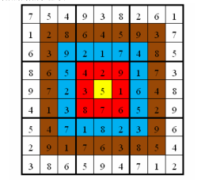

**Target-shaped Sudoku**

**Problem Description**

Xiaocheng and Xiaohua are both good students who love math. Recently, they are equally addicted to Sudoku. They are competitive and want to compete with each other with Sudoku. But ordinary Sudoku was too easy for them, so they asked Dr. Z, who gave them his recently invented \"target-shaped Sudoku\" for the two children to compete on.

The squares of target-shaped Sudoku are the same as the squares of ordinary Sudoku. There are 9 small nine-grids which are 3-square wide and 3-square high (separated by thick black lines) in the large nine-grid which is 9-square wide and 9-square high. In this large grid, some numbers are known, and with these numbers, use logical reasoning and fill in the other spaces with the numbers 1 to 9. Each digit cannot be repeated in each small nine-grid, and each digit cannot be repeated in each row or column. But target-shaped Sudoku differ from ordinary Sudoku in that each square has a score, and like a target, the closer the square is to the center, the higher the score. (As the figure shows)

The specific score distribution in the figure above is: The innermost circle (the yellow area) is worth 10 points, the circle outside the yellow area (the red area) is worth 9 points per square, the circle outside the red area (the blue area) is worth 8 points per square, the circle outside the blue area (the brown area) is worth 7 points per square, the outermost circle (the white area) is worth 6 points per square, as shown in the figure above. The requirement of the game is that: Each person must complete a given Sudoku (each given Sudoku may have a different way to fill it) and strive for a higher total score.

The total score is the total sum of the product of the score on each square and the number filled in the corresponding square when completing the Sudoku. As shown in the figure below, in the following target-shaped Sudoku with the numbers filled in, the total score is 2829. The rules of the game is that the outcome will be determined by the total score.

Because Xiaocheng is emulative, he came to you for your programming skills. He asks you to help him find out the highest score he can get for a given target-shaped Sudoku.

**Input**

There are 9 lines. In each line, there are 9 integers (every number is within the range of 0\~9), representing a nine-grid that has not been fully filled, and the unfilled square is represented by "0". Every two numbers are separated by a space.

**Output**

There is only 1 line. Output the highest total score of the target-shaped Sudoku. If this Sudoku has no solution, then output the integer -1.

**Sample Input 1**

7 0 0 9 0 0 0 0 1

1 0 0 0 0 5 9 0 0

0 0 0 2 0 0 0 8 0

0 0 5 0 2 0 0 0 3

0 0 0 0 0 0 6 4 8

4 1 3 0 0 0 0 0 0

0 0 7 0 0 2 0 9 0

2 0 1 0 6 0 8 0 4

0 8 0 5 0 4 0 1 2

**Sample Output 1**

2829

**Sample Input 2**

0 0 0 7 0 2 4 5 3

9 0 0 0 0 8 0 0 0

7 4 0 0 0 5 0 1 0

1 9 5 0 8 0 0 0 0

0 7 0 0 0 0 0 2 5

0 3 0 5 7 9 1 0 8

0 0 0 6 0 1 0 0 0

0 6 0 9 0 0 0 0 1

0 0 0 0 0 0 0 0 6

**Sample Output 2**

2852

**Hint**

**\[Data Scale and Constraints\]**

For 40% of the data, the number of non-zero numbers in the Sudoku is no less than 30.

For 80% of the data, the number of non-zero numbers in the Sudoku is no less than 26.

For 100% of the data, the number of non-zero numbers in the Sudoku is no less than 24.
