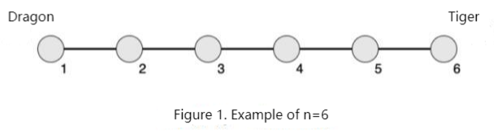
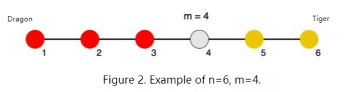

**The Battle Between Dragon and Tiger**

**Problem Description**

Xuanxuan and Kaikai are playing a game called The Battle between Dragon and Tiger. The board of the game is a line segment with n barracks (numbered 1 to n from left to right) on the line segment. Adjacent numbered barracks are separated by 1 cm, meaning the board is a line segment of length n −1 cm. There are c~i~ sappers in barracks i. Figure 1 below is an example of n=6:

Xuanxuan is on the left, representing "dragon"; Kaikai is on the right, representing "tiger". Divided by Barracks m, the sappers on the left belong to the dragon, the sappers on the right belong to the tiger, and the sappers in Barracks m are very tangled, they don't belong to either side.

The power of a barracks is the number of sappers in the barracks × the distance from this barracks to the Barracks m; The power of a playing party is defined as the sum of the power of all the barracks belonging to that party.

Figure 2 below is an example of n=6 and m=4, where red is dragon and yellow is tiger:

In the course of the game, at a certain moment, supplemental power including s~1~ sappers appears in Barracks p~1~. As a friend of Xuanxuan and Kaikai, you know that they will not be willing to continue playing the game if the gap of power between dragon and tiger is too great. For the game to continue, you need to choose a Barracks p~2~ and send all of your s~2~ sappers to Barracks p~2~ to keep the gap of power between the two sides as small as possible.

Note: Any sappers you land in will have the same influence as any sappers in that barracks (if they land in Barracks m, they will not have any influence).

**Input**

The first line contains a positive integer n, representing the number of barracks.

The next line contains n positive integers. Two adjacent numbers are separated by a space. The i^th^ positive integer represents the number of sappers ci in Barrack i at the beginning.

The next line contains four positive integers, separated by spaces, representing m, p~1~, s~1~, and s~2~.

**Output**

There is a line containing a positive integer, p~2~, which represents the barracks number you selected. If multiple barracks are optimal, select the one with the smallest serial number.

**Sample Input**

6

2 3 2 3 2 3

4 6 5 2

**Sample Output**

2

**Hint**

**Sample Input 2**

6
1 1 1 1 1 16
5 4 1 1

**Sample Output 2**

1

**\[Explanation of Sample 1\]**

See Figure 2 in the problem description.

The two sides are divided by Barracks m=4, with s~1~=5 sappers suddenly appearing in Barracks p1=6. The power of the dragon is:

2×(4−1)+3×(4−2)+2×(4−3)=14

The power of the tiger is:

2×(5−4)+(3+5)×(6−4)=18

When you send s~2~=2 sappers to Barracks p~2~=2, the dragon's power changes to:

14+2×(4−2)=18

Now the power of the two sides is equal.

**\[Explanation of Sample 2\]**

The two sides are divided by Barracks m=5, with s~1~=1 sapper suddenly appearing in Barracks p~1~=4.

The power of the dragon is:

1×(5−1)+1×(5−2)+1×(5−3)+(1+1)×(5−4)=11

The power of the tiger is:

16×(6−5)=16

When you send s~2~=1 sapper to Barracks p~2~ =1, the dragon's power changes to:

11+1×(5−1)=15

Now the gap of power between the two sides is the smallest.

**\[Data Size and Constraints\]**

For 20% of the data, n=3,m=2, c= 1, s~1~, s~2~ ≤ 100.

For another 20% of the data, n ≤ 10, 1= m, c=1 , s~1~, s~2~ ≤ 100.

For 60% of the data, n ≤ 100, c = 1,s~1~,s~2~ ≤ 100.

For 80% of the data, n ≤ 100, c, s~1~, s~2~ ≤ 100.

For 100% of the data, n ≤ 10^5^,c, s~1~, s~2~ ≤ 10^9^.
