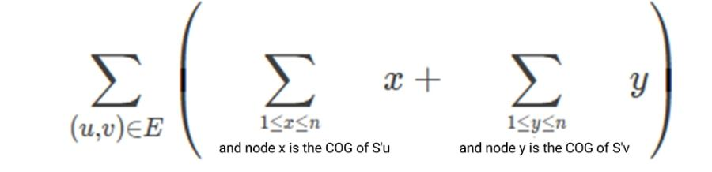

**The Center of Gravity of the Tree**

**Problem Description**

Littleeasy is learning discrete mathematics. Today's lecture is about graph theory fundamentals. In class, he made the following two notes:

1\. A tree of size n consists of n nodes and n−1 undirected edges and satisfies that **there is and only is** one simple path between any two nodes. If one deletes a node and its associated edges from the tree, the tree will split into subtrees. If one removes an edge from the tree (keeping the associated nodes, the same below) and the tree will split into **exactly** two subtrees.

2\. For a tree of size n and any node c in the tree, c is the **center of gravity** of the tree if and only if when c and its associated edges are deleted from the tree, the sizes of all the split subtrees are at most ⌊ ⌋(where ⌊x ⌋ is the down-rounding function). For a tree that contains at least one node, it can only have 1 or 2 centers of gravity.

After class, the teacher gave a tree S of size n. The nodes in the tree were numbered from 1 to n. Littleeasy's assignment is to find the sum of the numbers of the centers of gravity of the two subtrees that S splits into after deleting each edge individually. That is:

In the above expression, E represents the set of edges of tree S, and (u,v) represents an edge connecting points u and v. S'~u~ and S'~v~ denote the subtrees that are split out where u point and v point are located after deleting edge (u,v) from tree S respectively.

Littleeasy thinks that the assignment is not easy, so he has to ask you for help, please help him.

**Input**

**This question contains multiple sets of test data.**

There is an integer T in the first line, representing the number of groups.

Next, give each set of input data in turn, and for each set:

There is an integer n in the first line, representing the size of the tree S.

In the next n−1 lines, each line has two space-separated integers u~i~ and v~i~, representing an edge in the tree (u~i~, v~i~).

**Output**

There are T lines, with one integer per line, and the integer in line i represents: the sum of the numbers of the centers of gravity of the two subtrees that the tree given by the data of group i split into after deleting each edge individually.

**Sample Input**

2

5

1 2

2 3

2 4

3 5

7

1 2

1 3

1 4

3 5

3 6

6 7

**Sample Output**

32

56

**Hint**

**\[Explanation of the Sample\]**

For the first set of data:

Delete the edge (1,2), and the center of gravity of the subtree where node 1 is located is numbered {1}, and the center of gravity of the subtree where node 2 is located is numbered {2,3}.

Delete the edge (2,3), and the center of gravity of the subtree where point 2 is located is numbered {2}, and the center of gravity of the subtree where node 3 is located is {3,5}.

Delete the edge (2,4), and the center of gravity of the subtree where node 2 is located is {2,3}, and the center of gravity of the subtree where node 4 is located is {4}.

Delete the edge (3,5), and the center of gravity of the subtree where node 3 is located is {2}, and the center of gravity of the subtree where node 5 is located is {5}.

So the answer is 1 + 2 + 3 + 2 + 3 + 5 + 2 + 3 + 4 + 2 + 5 = 32.

**\[Data Range\]**

---

  Test Point   n=       Special Properties
  1\~2         7        None
  3\~5         199      None
  6\~8         1999     None
  9\~11        49991    A
  12\~15       262143   B
  16           99995    None
  17\~18       199995   None
  19\~20       299995   None

---

In the "special properties" column of the table, the two variables mean that there exists a 1\~n permutation p~i~ (1 ≤ i ≤ n), such that:

\- A: The form of the tree is a chain. That is, ∀1≤ i \<n, and there exists an edge (p~i~, p~i+1~).

\- B: The form of the tree is a perfect binary tree. Namely ∀ 1≤ i \< , there are two edges (p~i~, p~2i~) and (p~i~, p~2i+1~).

For all test points: 1 ≤ T ≤ 5, 1 ≤ u~i~, v~i~ ≤ n. Guarantee that the graph given is a tree.
