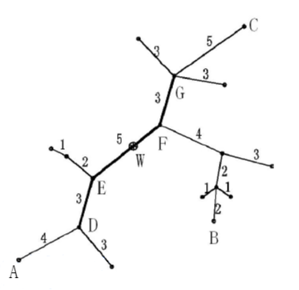

**The Core of the Tree Network**

**Problem description**

Let T= (V,E,W) be an acyclic and connected undigraph (also known as an unrooted tree), and each edge has a positive integer weight. We call T a "tree network", where V and E represent the set of nodes and edges respectively, and W represents the set of edge lengths, and let T have n nodes.

**Path:** There is a unique simple path for any two nodes a and b in the tree network, the length of the path with a and b as the endpoints is denoted by d (a,b), which is the sum of the length of each edge on the path. Let's call d (a,b) the distance between nodes a and b.

D (v, P)=min{d (v, u)}, where u is the node on path P.

**Diameter of the tree network:** The longest path in the tree network is called the diameter of the tree network. For a given tree network T, the diameter is not necessarily unique, but it can be proved that: the midpoint of each diameter (not necessarily exactly a node, may be inside an edge) is unique. We call this point the center of the tree network.

**Eccentricity ECC (F):** the distance between the node farthest from path F in tree network T and path F, namely ECC (F) = Max {D (v,F), v∈V}.

**Task:** For a given tree network T = (V,E,W) and a non-negative integer s, find a path F, which is a segment of path on one diameter (both ends of the path are nodes in the tree network), and its length is not more than s (can be equal to s), so that the eccentricity ECC (F) is minimized. We call this path the core of the tree network T= (V,E,W). If necessary, F can degenerate to a node. In general, under the above definition, there is not necessarily only one core, but the minimum eccentricity is unique.

The following figure shows an example of a tree network. In the figure, A-B and A-C are two diameters with lengths of 20. Point W is the center of the tree network, and the length of the edge EF is 5. If s=11 is specified, the core of the tree network is path DEFG (or DEF) and the eccentricity is 8. If s=0 (or s=1 or s=2) is specified, then the core of the tree network is node F and the eccentricity is 12.

**Input**

The input file contains n lines.

In line 1, two positive integers n and s are separated by a space. n is the number of nodes in the tree network, and s is the upper bound of the length of the core of the tree network. Let the node numbers be 1, 2, \..., n.

From line 2 to line n, each line gives three positive integers u, v, w, separated by spaces, representing the two endpoint numbers and lengths of each edge in turn. For example, "2 4 7" means that the length of the edge connecting nodes 2 and 4 is 7.

**Output**

The output file has only one non-negative integer, which is the minimum eccentricity in the specified sense.

**Sample Input 1**

5 2

1 2 5

2 3 2

2 4 4

2 5 3

**Sample Output 1**

5

**Sample Input 2**

8 6

1 3 2

2 3 2

3 4 6

4 5 3

4 6 4

4 7 2

7 8 3

**Sample Output 2**

5

**Hint**

For 40% of the data, n ≤ 15

For 70% of the data, n ≤ 80

For 100% of the data, n ≤ 300, 0 ≤ s ≤ 10^3^, 1 ≤ u, v ≤ n, 1 ≤ w ≤ 10^3^.
