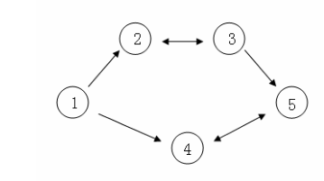

**The Optimal Trade**

**Problem Description**

Country C has n big cities and m roads, and each road connects two of the n cities. No more than one road directly connects any two cities. Some of the m roads are one-way roads and others are two-way roads. When counting the number of the roads, the two-way roads are also counted as 1.

C is a vast country, and the distribution of resources varies from place to place, which leads to the fact that the price of the same commodity may not be the same in different cities. However, the buying price and selling price of the same commodity in the same city are always the same.

Businessman Aron came to country C for a tour. When he learned that the price of the same commodity may be different in different cities, he decided to use the price difference of the commodity in different cities to make back some of the travel expenses. Given that n cities in C are numbered from 1 to n, Aron decided to start from city 1 and end his trip in city n. During the tour, any city can be passed several times, but it is not required to pass all n cities. Aron will earn his travel money in this way of trading: He will buy his favorite commodity, a crystal ball, in a city he passed through, and sell it in another city he passed through, and use the difference for his trip. Since Aaron mainly comes to C for tourism, he decided to carry out this trade only once at most. Of course, he doesn't need to carry out trade if he can't earn the difference.

Assume that there are 5 big cities in C, and the numbers of cities and road connections are as the following figure: one-way arrow means one-way traffic on this road, and two-way arrow means two-way traffic on this road.

Assume that the price of the crystal ball from city 1 to n are 4, 3, 5, 6, 1.

Aron can choose a route like this: 1→2→3→5, and buy the crystal ball at the price of 3 in city 2, and sell it at the price of 5 in city 3, earning 2.

Aron can also choose a route like this: 1→4→5→4→5, and buy the crystal ball at the price of 1 when he reaches city 5 for the first time, and sell it at the price of 6 when he reaches city 4 for the second time, earning 5.

Now given the price of the crystal ball of the n cities, and the information of the m roads (the number of the two cities connected by the road and the condition of traffic). Now please tell Aron the most he can earn for the trip.

**Input**

The first line contains 2 positive integers n and m, separated by a space, representing the number of cities and the number of roads respectively.

The second line contains n positive integers, every two integers are separated by a space, each representing the price of the commodities in these n cities in the order of the serial number.

For the next m lines, there are 3 positive integers x, y, z in each line, separated by a space between every two integers. If z=1, it indicates that this road is a one-way road between city x and city y; if z=2, it indicates that this road is a two-way road between city x and city y.

**Output**

There is an integer, representing the most travelling expenses he could earn. If there is no trade, then output 0.

**Sample Input**

5 5

4 3 5 6 1

1 2 1

1 4 1

2 3 2

3 5 1

4 5 2

**Sample Output**

5

**Hint**

**\[Data Range\]**

The input data ensures that city n can be reached from city 1.

For 10% of the data, 1≤n≤6.

For 30% of the data, 1≤n≤100.

For 50% of the data, there is no such tourist route that starts from a city and returns to it.

For 100% of the data, 1≤n≤100000, 1≤m≤500000, 1≤x,y≤n, 1≤z≤2, 1≤the price of the crystal ball in every city≤100.
