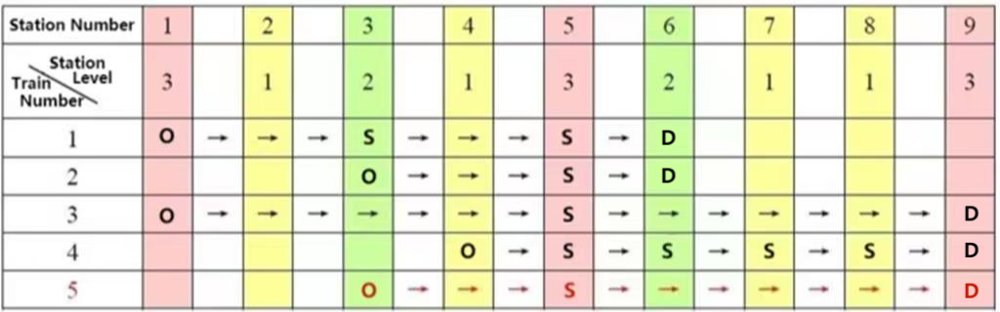

**The Station Classification**

**Problem Description**

There are n railway stations on a one-way railway line, successively numbered 1, 2, \..., n. Each train station has a level with a minimum of 1 level. There are several trains running on this line, each of which satisfies the following requirement: If this train stops at station x, then it must stop at every station between the origin and destination with a level higher than or equal to that of station x. (Note: the origin and destination stations naturally count as pre-known stops.)

For example, the following table shows the operation of 5 trains. Among them, the first four trains meet the requirements, but the fifth train does not meet the requirements because it stops at Station 3 (level 2) but does not stop at Station 6 (also level 2). (Note: O stands for Origin, S stands for Stop, and D stands for Destination)

Now there are m trains running (all meet the requirements), try to calculate how many different levels do these n railway stations have at least.

**Input**

The first line contains 2 positive integers, n and m, separated by a space.

In line i+1 (1 ≤ i ≤ m), first, there is a positive integer si (2 ≤ si ≤ n), indicating that the i^th^ train has si stops; Then there are si positive integers representing the numbers of all stopping stations, ranked from smallest to largest, separated by spaces. It is ensured that all trains in the input meet the requirements.

For 20% of the data, 1 ≤ n, m ≤ 10;

For 50% of the data, 1 ≤ n, m ≤ 100;

For 100% of the data, 1 ≤ n, m ≤ 1000.

**Output**

There is only one line containing an integer, which is the number of levels of the minimum division of n railway stations.

**Sample Input**

9 2

4 1 3 5 6

3 3 5 6

**Sample Output**

2
