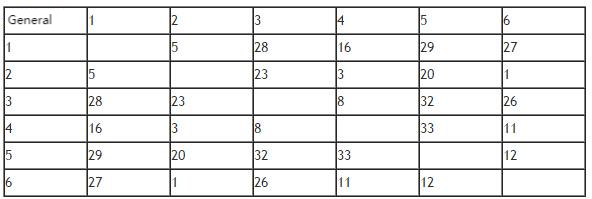

**The Three Kingdom Game**

**Problem Description**

Xiao Han likes playing video games very much. These days he has been playing a game called *Three Kingdoms*.

In this game, Xiao Han and the computer are on opposite sides, and they need to set up their own army to fight. There are N generals in the game (N is an even number and not less than 4), and there is a value called "bonding level" between any two generals, which indicates how powerful the combination would be if the two generals fought as a pair. Before the game starts, all generals are free (called free generals, once a certain free general is selected as a member of a certain army, then it is no longer a free general), in other words, the so-called free generals do not belong to any side. At the beginning of the game, Xiao Han and the computer have to choose the generals from the free generals to form their own army. The rules are as follows: Xiao Han first chooses one of the free generals to join his army, and then the computer chooses one of the free generals to join the army of the computer side. Then the selection of generals follows the order of "Xiao Han → computer → Xiao Han\..." until all the generals are divided equally between the two sides. Then, the program automatically selects a pair of generals with the highest bonding level from each army to compete with the opponent two to two on behalf of their own army. The pair with the higher bonding level wins, indicating that the two armies are engaged, and the one with the winning generals wins.

It is known that the computer side's principle of choosing general is to try to stop the opponent from forming the strongest combination in the next step, it adopts the specific strategy as follows: At any given moment, when it is the computer's turn to pick, it will try to match every general in the opponent's army with every current free general, find the pair with the highest bonding level among all pairs, and select the free general in that pair into its own army.

The following is an example of the computer's strategy for selecting generals: for example, there are six generals in the game, and their bonding level levels are shown in the table below.

The selection process of both sides is as follows:

---

    Xiao Han   Free generals left in the computer's turn   Computer   The reason of computer's choice
  The first round    5          1 2 3 4 6                                   4          General 5 in Xiao Han's army can get the highest bonding level when pairing with General 4, so it chooses 4.
  The second round   5 3        1 2 6                                       4 1        The highest bonding level that general 5 and general 3 in Xiao Han's army can get by pairing with free generals is 29 when general 5 is pairing up with general 1. So the computer chooses general 1.
  The third round    5 3 6      2                                           4 1 2

---

Xiao Han wants to know, if the computer sticks to the above strategy throughout a game, is it possible for him to win in all circumstances? If so, what is the maximum bonding level of the pair of generals which compete on behalf of the whole army out of all possible victory outcomes?

It is assumed that at any time during the game, both sides can see the free generals and the general of the opposing army. To simplify the problem, it is ensured that for different combinations of generals, their bonding levels are not the same.

**\[Constraints\] **

For 40% of the data, N≤ 10.

For 70% of the data, N≤ 18.

For 100% of the data, N≤ 500.

**Input**

There are N lines.

The first line contains a positive integer N, representing the number of generals.

From the second line to the N line, the (i+1) line has (N-i) non-negative integers, each two numbers are separated by a space, representing the bonding level between general i and general i+1, i+2, \..., N. (0 ≤ bonding level ≤ 1,000,000,000)

**Output**

There are 1 or 2 lines.

If for a given input, there is a selection order that can make Xiao Han win, then output 1, and another line output the maximum bonding level value of the general combination finally selected by Xiao Han in all the winning situations.

If there is no selection order that can make Xiao Han win, then output 0.

**Sample Input**

6

5 28 16 29 27

23 3 20 1

8 32 26

33 11

12

**Sample Output**

1

32
