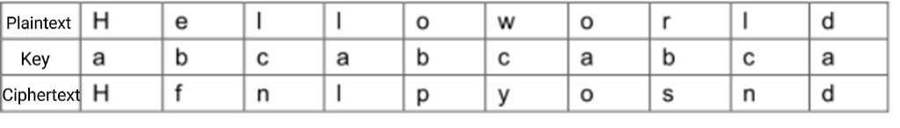

**The Vigenère Code**

**Problem Description**

16~th~-century French diplomat Blaise de Vigenère designed a multi-table cipher encryption algorithm called the Vigenère code. The encryption and decryption algorithm of the Vigenère code is simple and easy to use, and the deciphering difficulty is relatively high. It was widely used by the Southern army in the American Civil War.

In cryptography, the message to be encrypted is called plaintext, denoted by M; the encrypted message is called the ciphertext, denoted by C; and the key is a parameter, which is the input data in the algorithm that converts the plaintext to ciphertext or ciphertext to plaintext, denoted as k. In the Vigenère code, the key k is a string of letters, k =k~1~, k~2~,\..., k~n~. When the plaintext M = m~1~, m~2~,\..., m~n~, the resulting ciphertext C= c~1~, c~2~,\..., c~n~, where c~i~ = m\_i ® k\_i, the rule of operation ® is shown in the following table:

The following tips need to be noted when operating the Vigenère code:

1\. The ® operation ignores the case of the letters involved in the operation and keeps the case of the letters in the plaintext M;

2\. Reuse the key k when the length of the plaintext M is greater than the length of the key k.

For example, when the plaintext M=Helloworld and the key k=abc, the ciphertext C=Hfnlpyosnd.

\$\~%%IDC31KOB\$U(1)\_mh1664128950953" />{width="5.759722222222222in" 

**Input**

There are two lines.

The first line is a string representing key k, which is not more than 100 in length and contains only uppercase and lowercase letters.

The second line is a string representing the encrypted ciphertext, which is not more than 1000 in length and contains only uppercase and lowercase letters.

**Output**

There is a string indicating the plaintext to which the input key and ciphertext correspond.

**Sample Input**

CompleteVictory

Yvqgpxaimmklongnzfwpvxmniytm

**Sample Output**

Wherethereisawillthereisaway

**Hint**

For 100% of the data, the input key is not more than 100 in length, the input ciphertext no longer than 1000, and both contain only English letters.
