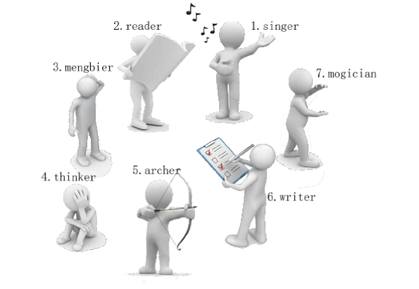
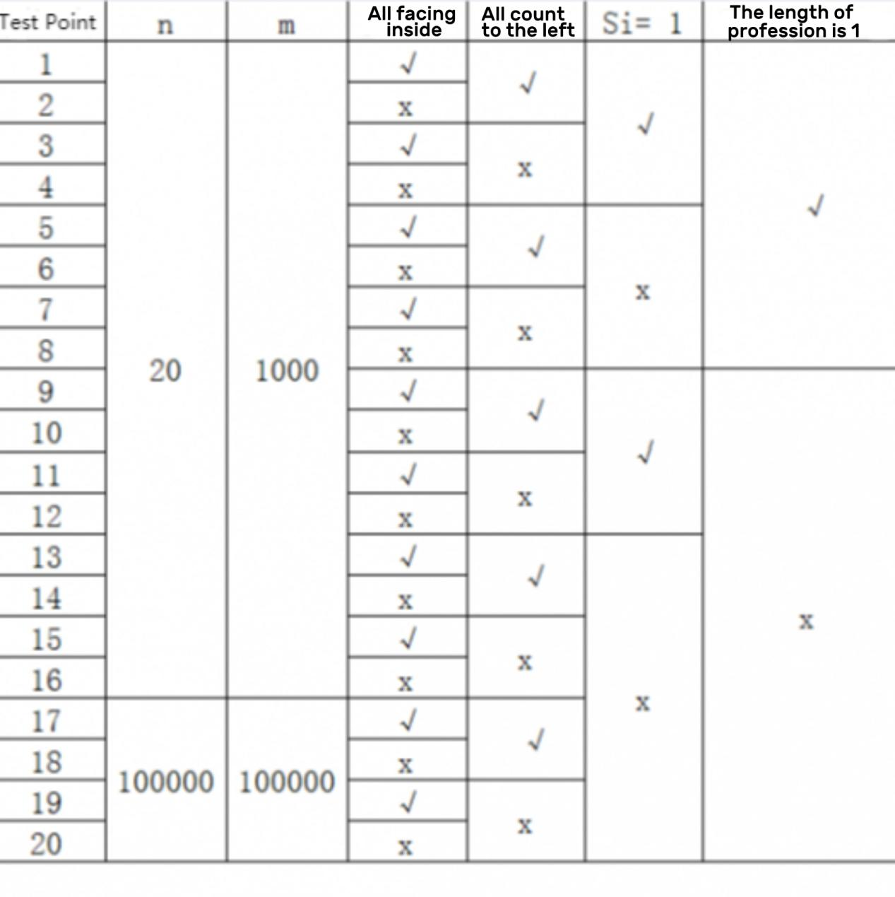

**Toy Puzzle**

**Problem Description**

Xiaonan has a set of cute toy figures, each with a different profession.

One day, the little toys hid her glasses. Xiaonan found that the toys were in a circle. Some of them were facing inside the circle, while others were facing outside. As the image below:

Then Singer tells Xiaonan a puzzle: "The glasses are hidden at the second toy to the left of the first toy to the right of the third toy to the left of me."

Xiaonan found that the orientation of the toy figure in the puzzle was crucial because the toy figures facing inside and outside had opposite directions: for the toy figure facing inside the circle, its left side is clockwise and its right side is counterclockwise; for the toy figure facing outside the circle, its left side is counterclockwise and its right side is clockwise.

Xiaonan is struggling to identify the toy while counting:

Singer is facing inside. The third person on its left is Archer.

Archer is facing outside. The first person on its right is Thinker.

Thinker is facing outside. The second person on its left is Writer.

So the glasses are hidden at Writer!

Although the glasses are successfully found, Xiaonan is not reassured. If more toys hide his glasses next time, or if the puzzle is longer, he may not be able to find them. So Xiaonan would like you to write a program to help him solve similar puzzles. A puzzle like this can be described as follows:

There are n toy figures in a circle, and their professions and orientations are known. Now the first toy tells Xiaonan a puzzle with m instructions, where the z^th^ instruction is shaped like "the s^th^ toy to the left/right". You need to output the profession of the toy after counting the instructions one by one.

**Input**

The first line of the input contains two positive integers n and m for the number of toy figures and the number of instructions.

The next n lines, each containing an integer and a string, give the orientation and profession of each toy figure in counterclockwise order. 0 indicates the toy is facing inside the circle and 1 indicates the toy is facing outside the circle. No other numbers appear. The string should be no longer than 10 and only consist of lowercase letters. The string should not be empty. And they are different from each other. There is a space between the integer and the string.

For the next m lines, the i^th^ line contains two integers a~i~ and s~i~ for the i^th^ instruction. If a~i~=0, count s~i~ toy(s) to the left; If a~i~=1, count s~i~ toy(s) to the right. No other number appears in a~i.~ 1 ≤ s~i~ \< n.

**Output**

Output a string indicating the profession of the toy after following m instructions, starting with the first toy being read.

**Sample Input 1**

7 3

0 singer

0 reader

0 mengbier

1 thinker

1 archer

0 writer

1 mogician

0 3

1 1

0 2

**Sample Output 1**

writer

**Sample Input 2**

10 10

1 c

0 r

0 p

1 d

1 e

1 m

1 t

1 y

1 u

0 v

1 7

1 1

1 4

0 5

0 3

0 1

1 6

1 2

0 8

0 4

**Sample Output 2**

y

**Hint**

**\[Explanation of Sample 1\]**

This data set is the example mentioned in the \[problem description\].

**\[Subtask\]**

The subtask will give you the characteristics of part of the test data. If you\'re having trouble solving the problem, try solving only a portion of the test data.

The data size and characteristics of each test point are shown in the following table:

Some of the shorthand names of columns have the following meanings:

\- All facing inside: If it is "√", it means that the test point ensures that all toy figures are facing inside the circle;

\- All count to the left: if it is "√", it means that the test point ensures that all instructions are "count s~i~ toy(s) to the left", that is, for any 1 ≤ z ≤ m, a~i~=0;

\- s~i~ =1: if it is "√", it means that the test point ensures that all the instructions are "count 1 toy to the left/right", that is, for any 1 ≤ z ≤ m, s~i~=1;

\- The length of profession is 1: if it is "√", it means that the test point ensures that the profession of all toys must be a string of length 1.
