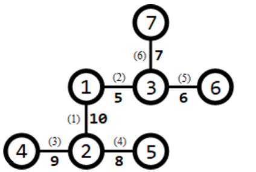
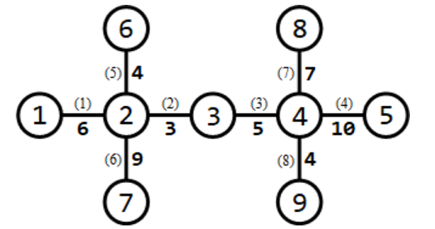

**Track Construction**

**Problem Description**

City C is going to host a series of car races. m race tracks need to be built in the city before the race.

C city has a total of n intersections. These intersections are numbered 1, 2, \..., n, there are n-1 two-way roads suitable for the construction of racetracks, each connecting two intersections. The two intersections connected by the i^th^ road are numbered a~i~ and b~i~, and the length of this road is l~i~. With the help of these n-1 roads, all the other intersections can be reached from any one of them.

A track is a distinct set of roads e~1~, e~2~, \..., e~k~, satisfies that one can start from a certain intersection and pass the road e~1~, e~2~, \..., e~k~ (each road passes once, no U-turns allowed) to reach another intersection. The length of a track is equal to the sum of the lengths of the roads that pass through. To ensure safety, each road is required to be traversed by at most one track.

At present, the construction plan of the track has not been determined. Your task is to design a track construction scheme such that the length of the shortest of the m tracks is the largest (i.e. the shortest of the m tracks is as long as possible).

**Input**

The first line of the input file contains two positive integers n and m separated by a space, representing the number of intersections and the number of tracks to be built.

For the next n-1 lines, the first line contains three positive integers a~i~, b~i~, and l~i~, which represent the number of the two junctions connected by the i^th^ road suitable for the construction of the race track and the length of this road. It is ensured that any two intersections are reachable from each other via these n-1 roads. Every two adjacent numbers in each line are separated by a space.

**Output**

The output is only one line and contains an integer representing the maximum length of the track with the smallest length.

**Sample Input 1**

7 1

1 2 10

1 3 5

2 4 9

2 5 8

3 6 6

3 7 7

**Sample Output 1**

31

**Sample Input 2**

9 3

1 2 6

2 3 3

3 4 5

4 5 10

6 2 4

7 2 9

8 4 7

9 4 4

**Sample Output 2**

15

**Hint**

**\[Explanation of Sample 1\]**

All intersections and roads suitable for the construction of the track are shown below:

Numbers in parentheses next to the road indicate the number of the road, and numbers not in parentheses indicate the length of the road. One track is required to be built. You can build a track that goes through the 3^rd^, 1^st^, 2^nd^, and 6^th^ roads (from junction 4 to junction 7), then the length of this track is 9 + 10 + 5 + 7 = 31, which is the maximum of all the schemes.

**\[Explanation of Sample 2\]**

All intersections and roads suitable for the construction of the track are shown below:

3 tracks need to be built. 3 tracks can be built as follows:

1\. The track that goes through roads 1 and 6 (from junction 1 to junction 7), has a length of 6 + 9 = 15;

2\. The track that goes through the 5^th^, 2^nd^, 3^rd^, and 8^th^ roads (from junction 6 to junction 9) has a length of 4 + 3 + 5 + 4 = 16;

3\. The track that goes through the 7^th^ and 4^th^ roads (from junction 8 to junction 5) has a length of 7 + 10 = 17. The track with the smallest length has a length of 15, which is the maximum of all schemes.

**\[Data Scale and Conventions\]**

---

  Test Point   n          m      a~i~=1   b~i~=a~i~+1   The number of branches do not exceed 3
  1            ≤5         =1     No       No            Yes
  2            ≤10        ≤n−1   No       Yes           Yes
  3            ≤15        ≤n−1   Yes      No            No
  4            ≤10^3^     =1     No       No            Yes
  5            ≤3×10^4^   =1     Yes      No            No
  6            ≤3×10^4^   =1     No       No            No
  7            ≤3×10^4^   ≤n−1   Yes      No            No
  8            ≤5×10^4^   ≤n−1   Yes      No            No
  9            ≤10^3^     ≤n−1   No       Yes           Yes
  10           ≤3×10^4^   ≤n−1   No       Yes           Yes
  11           ≤5×10^4^   ≤n−1   No       Yes           Yes
  12           ≤50        ≤n−1   No       No            Yes
  13           ≤50        ≤n−1   No       No            Yes
  14           ≤200       ≤n−1   No       No            Yes
  15           ≤200       ≤n−1   No       No            Yes
  16           ≤10^3^     ≤n−1   No       No            Yes
  17           ≤10^3^     ≤n−1   No       No            No
  18           ≤3×10^4^   ≤n−1   No       No            No
  19           ≤3×10^4^   ≤n−1   No       No            No
  20           ≤5×10^4^   ≤n−1   No       No            No

---

Among these, "The number of branches do not exceed 3" means that each intersection is connected by at most 3 roads.

For all data, 2 ≤ n ≤ 5×10^4^, 1 ≤ m ≤ n − 1, 1 ≤ a~i~, b~i~ ≤ n, 1 ≤ l~i~ ≤ 10^4^.
