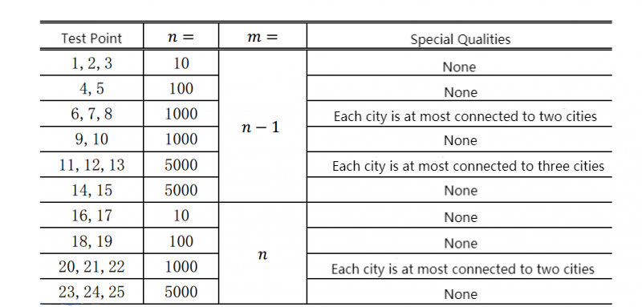

**Travel**

**Problem Description**

Y is an OIer who loves to travel. She comes to Country X and plans to visit every city.

Y learns that there are m two-way roads between the cities in Country X. Each two-way road connects two cities. There are no two roads connecting the same pair of cities, and there is no road connecting a city to itself. And, starting from any city, you can reach any other city by these roads. Y can only travel from one city to another via these roads.

Y's travel plan is as follows: pick any city as a starting point, and from there, walk to a new city by choosing a road connected to the current city, or back to the previous city by following the road she took when she entered the city for the first time. When Y returns to her starting point, she can choose to end her trip or continue her trip. It should be noted that Y requires that every city should be visited in the touring scheme.

To make her trip more meaningful, Y decides to record the number of the new city (including the starting point) every time she arrives. She knew this would create a sequence of length n. She wants the sequence to have the smallest lexicographic order, can you help her? For two sequences A and B, both of length n, we say that sequence A has less lexicographic order than B if and only if there exists a positive integer x that satisfies the following conditions:

\- For any positive integer 1 ≤ i \< x, the i^th^ element A~i~ of sequence A and the i^th^ element B~i~ of sequence B are the same.

\- The value of the x^th^ element of sequence A is less than the value of the x^th^ element of sequence B.

**Input**

The input file has m+1 lines in total. The first line contains two integers n and m (m ≤ n) separated by a space.

For the next m lines, each of them contains two integers u and v (1 ≤ u,v ≤ n), indicating that there is a road between the cities numbered u and v. The two integers are separated by a space.

**Output**

The output file contains one line with n integers, representing the sequence with the smallest lexicographic order. Two adjacent integers are separated by a space.

**Sample Input 1**

6 5

1 3

2 3

2 5

3 4

4 6

**Sample Output 1**

1 3 2 5 4 6

**Sample Input 2**

6 6

1 3

2 3

2 5

3 4

4 5

4 6

**Sample Output 2**

1 3 2 4 5 6

**Hint**

**\[Data Scale and Conventions\]**

For 100% of the data and all examples, 1 ≤ n ≤ 5000, and m = n − 1 or m = n.

For different test points, we agree on the scale of the data as follows:

