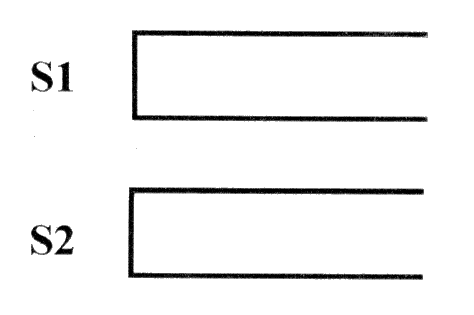
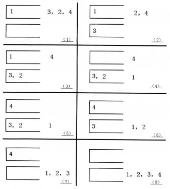

**Two Stack Sort**

**Problem Description**

Tom has been working on an interesting sorting problem. As shown in the figure, with two stacks S~1~ and S~2~, Tom wants to sort the input sequence in ascending order with the help of the following 4 operations.

Operation a: If the input sequence is not empty, push the first element into stack S~1~.

Operation b: If stack S~1~ is not empty, pop the top element of stack S~1~ to the output sequence.

Operation c: If the input sequence is not empty, push the first element into the stack S~2~.

Operation d: If stack S~2~ is not empty, pop the top element of stack S~2~ to the output sequence.

If a 1\~n permutation P can be manipulated so that the output sequence is (1, 2\..., n-1, n), Tom calls P a "two-stackable sort permutation". For example, (1,3,2,4) is a "two-stackable sort permutation", while (2,3,4,1) is not. The following diagram depicts a sequence of operations "a, c, c, b, a, d, d, b" that sort (1,3,2,4).

Of course, there may be several of such sequences of operations. For example, for (1,3,2,4), "a, b, a, a, b, b, a, b" is another feasible sequence of operations. Tom wants to know what the sequence of operations with the minimum dictionary order is.

**Input**

The first line of the input file is an integer n.

The second line has n positive integers separated by spaces, forming a permutation from 1 to n.

**Output**

The output file has one line, if the input is not "two-stackable sort permutation", output 0.

Otherwise, output the sequence of operations with the minimum dictionary order, each two operations separated by a space, no space at the end of the line.

**Sample Input 1**

4

1 2 3 4

**Sample Output 1**

a b a a b b a b

**Sample Input 2**

4

2 3 4 1

**Sample Output 2**

0

**Sample Input 3**

3

2 3 1

**Sample Output 3**

a c a b b d

**Hint**

30% of the data meet: n ≤ 10.

50% of the data meet: n ≤ 50.

100% of the data meet: n ≤ 1000.
